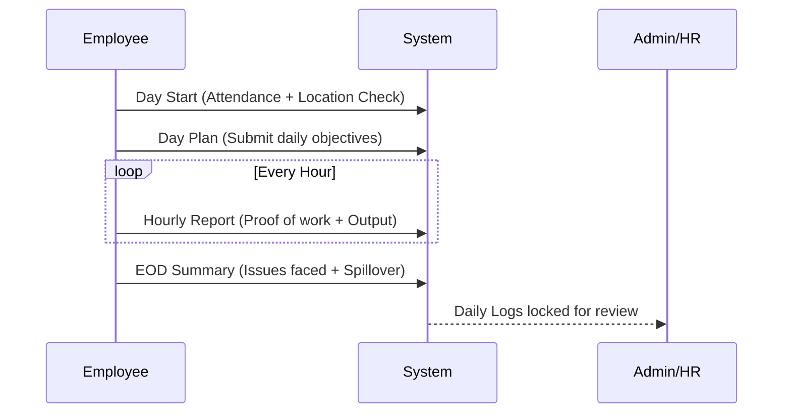
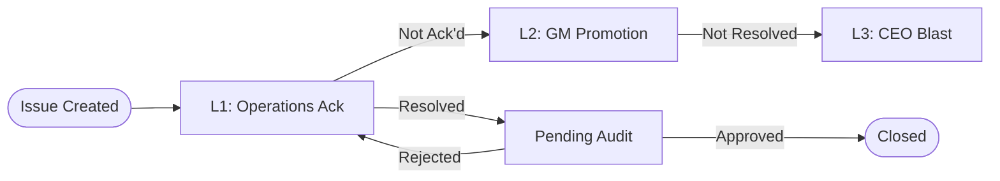

# IGO GROUP: Comprehensive Onboarding Guide

Welcome to the **IGO GROUP** development team! This document provides an inch-by-inch breakdown of the application architecture, workflows, and technical details to help you get up to speed quickly.

---

## 🏗️ Technical Architecture

IGO GROUP is a sophisticated ERP-style web application built for operational management across multiple business verticals (Construction, Agriculture, etc.).

### Tech Stack
- **Frontend**: [React](https://react.dev/) 18.3 with [Vite](https://vitejs.dev/)
- **Language**: [TypeScript](https://www.typescriptlang.org/)
- **Styling**: [Tailwind CSS](https://tailwindcss.com/) + [Shadcn UI](https://ui.shadcn.com/)
- **State Management**: [TanStack Query](https://tanstack.com/query/latest) (Fetching & Caching)
- **Backend/DB**: [Supabase](https://supabase.com/) (PostgreSQL, Realtime, Edge Functions, Auth)
- **Animations**: [Framer Motion](https://www.framer.com/motion/)

---

## 📁 Directory Structure Breakdown

```text
/IGO GROUP-main
├── /src
│   ├── /components      # Reusable UI components (shadcn components + custom)
│   ├── /contexts        # Globally shared logic (AuthContext, AlertProvider)
│   ├── /hooks           # Custom React hooks (Real-time listeners, API wrappers)
│   ├── /integrations    # Supabase client and auto-generated database types
│   ├── /lib             # Utility functions (utils.ts, date formatting)
│   ├── /pages           # Page-level components organized by module/role
│   │   ├── /admin       # Administrative tools (User Mgmt, Queue, Audits)
│   │   ├── /ceo         # Strategic dashboards and intelligence reports
│   │   ├── /employee    # Daily workflows (Day Start, Plans, Reports)
│   │   ├── /hr          # Attendance tracking and LOP management
│   │   └── /shared      # Pages accessible by multiple roles
│   ├── /types           # Shared TypeScript interfaces and enums
│   ├── App.tsx          # Main routing logic and role-based guards
│   └── main.tsx         # Application entry point
├── /supabase
│   ├── /functions       # Edge Functions (Backend logic, e.g., daily log locking)
│   └── migrations       # SQL migration files tracking schema changes
└── tailwind.config.ts   # Design system tokens and styling rules
```

---

## 🔐 Role-Based Access Control (RBAC)

The app uses a tiered role system defined in `profiles.role`.

### Core Roles
| Role | Primary Responsibility | Key Landing Page |
|:--- |:--- |:--- |
| **Admin** | System configuration, user management, audit oversight | `/admin-dashboard` |
| **CEO** | Strategic intelligence, high-level approvals, critical escalations | `/ceo-dashboard` |
| **GM** | Regional operations management, escalation L2 handling | `/gm-dashboard` |
| **Employee** | Daily execution, hourly reporting, material requests | `/day-start` |
| **HR** | Attendance verification, leave approvals, LOP management | `/hr-attendance` |
| **BOI** | Business operations intelligence, ticket dispatching | `/dashboard/boi` |

### Entry Flow (The "Redirect" Logic)
When a user logs in, the `RedirectPage` component determines their destination:

```mermaid
graph TD
    A[Login] --> B{Role Authenticated?}
    B -- Admin --> C[/admin-dashboard]
    B -- CEO --> D[/ceo-dashboard]
    B -- Employee --> E[/day-start]
    B -- HR --> F[/hr-attendance]
    B -- GMO/SMO --> G[/dashboard/gmo_smo]
    B -- Other --> H[/day-start]
```

---

## 🔄 Core Business Workflows

### 1. Daily Employee Workflow
Employees follow a strict reporting cycle to ensure operational transparency.



### 2. Escalation Resolution Flow
Critical issues (Escalations) are tracked in real-time and promoted through levels if not resolved.



---

## 📊 Core Data Models (Key Tables)

- **`profiles`**: User metadata, role, and department.
- **`client_escalations`**: Main ticket tracking for client/ops issues.
- **`hourly_reports`**: Daily granular proof-of-work logs.
- **`projects`**: Central project tracking for Construction/Agri.
- **`audit_logs`**: Immutable record of every sensitive action (Login, Approve, Edit).

---

## 🛠️ Getting Started for Developers

### 1. Environment Setup
Create a `.env` file in the root with:
```bash
VITE_SUPABASE_URL=your_project_url
VITE_SUPABASE_ANON_KEY=your_anon_key
```

### 2. Running Locally
```bash
npm install
npm run dev
```

### 3. Coding Guidelines
- **Strict Typing**: Always use types from `@/types/igo-chain` or `@/integrations/supabase/types`.
- **Real-time First**: Use hooks like `useRealtimeEscalations` for any dashboard data.
- **Atomic Components**: Use Shadcn components for UI; avoid writing large ad-hoc CSS blocks.
- **Audit Consistency**: Any state-changing logic must be logged via the `audit_logs` table.

---

## 🚀 Pro-Tips
- **The Redirection Trap**: If you navigate and get booted to `/redirect`, check the `allowedRoles` array in `App.tsx` for that route.
- **Supabase Edge Functions**: Logic like "locking logs at midnight" lives in the `/supabase/functions` folder.
- **Real-time Polling**: We prefer Postgres Realtime via `supabase.channel` over traditional `setInterval` polling.

---

*This document is a living guide. Please update it as you implement new modules or architectural changes.*
