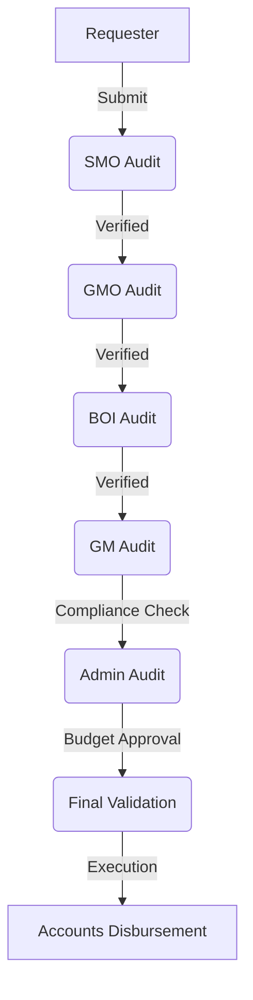
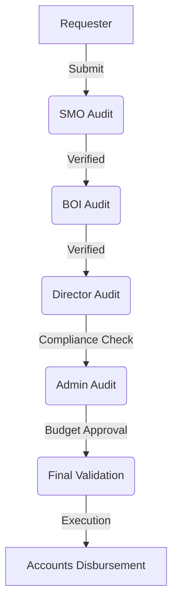
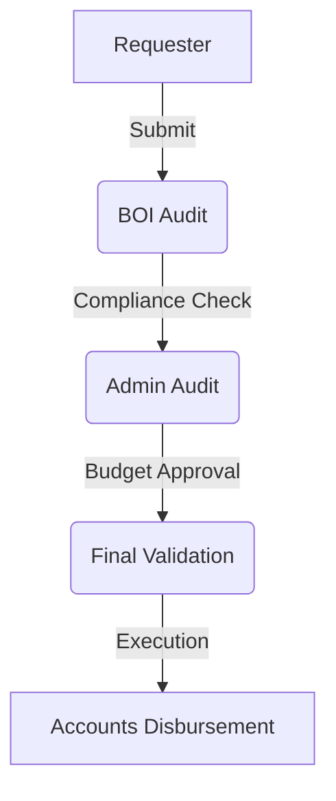

# IGO GROUP: Payment System Standard Operating Procedure (SOP)

This document defines the mandatory steps, roles, and compliance rules for all payment transactions within the IGO GROUP ERP ecosystem. 

---

## 🏛️ 1. Core Governance Principles
1. **Evidence-First**: No payment request shall be processed without a valid **Proof Folder** (Google Drive link) containing all necessary evidence ($$$).
    - **Link Requirement**: The folder MUST be set to **"Anyone with the link can view"**. Links requiring "Request Access" will be rejected immediately.
2. **Immutability**: Once a request is submitted, it is locked. No edits or deletions are permitted to ensure audit integrity.
3. **Role-Based Hierarchy**: Approval chains are automatically determined by the requester's department.
4. **Petty Cash Rule**: Small operational expenses tagged as "Petty Cash" by the Admin bypass the final escalation queue for immediate execution.

---

## 🔄 2. Departmental Approval Workflows

The ERP manages three distinct approval structures based on the complexity of the department.

### A. Agri Engineering Flow (7-Step Chain)
Used for complex site execution projects.

### B. Agricultural (Agri) Flow (6-Step Chain)
Used for farming and cultivation operations.

### C. Operational / Others Flow (4-Step Chain)
Used for HR, Sales, Logistics, and General Admin.

---

## 👥 3. Role-Based Procedures

### 🟢 1. The Requester (Employee / Site Engineer)
- **Action**: Create request via `Payment Request` screen.
- **Mandatory Data**:
    - Purpose (One-line description).
    - Accurate Bank/UPI details.
    - **Proof Folder**: A single Google Drive link containing the following organized items:
        - `Invoices/`: All vendor bills and invoices.
        - `Work_Photos/`: Photos showing the work/delivery.
        - `Work_Videos/`: Short video clips of the execution (if applicable).
        - `Delivery_Notes/`: Challans/Notes signed by site authority.
- **Checklist**:
    - [ ] Is the amount matching the proof in the folder?
    - [ ] Is the beneficiary name exactly as per bank records?
    - [ ] Is the Cut-off time minimum 2 hours from now?

### 🔵 2. Site Management Office (SMO)
- **Objective**: Technical verification of site needs.
- **Action**: Audit request in `SMO Payments` board.
- **Checklist**:
    - [ ] Does the material/service match the site BOQ?
    - [ ] Is the quantity requested justified for the current phase?

### 🟡 Business Operations Intelligence (BOI)
- **Objective**: Intelligence checking and fraud prevention.
- **Action**: Audit request in `BOI Payments` board.
- **Checklist**:
    - [ ] Are these links accessible? (No "Access Denied" G-Drive links).
    - [ ] Does the "Work Proof" actually show the work mentioned?
    - [ ] Rate the "Integrity" of the request.

### 🟠 GMO / Director / GM
- **Objective**: Vertical and Regional oversight.
- **Action**: Review high-value or specific department tickets.
- **Checklist**:
    - [ ] Does this request align with the monthly regional budget?
    - [ ] Is there any deviation from the original project cost?

### 🔴 Admin (Compliance Gatekeeper)
- **Objective**: Final systemic and compliance scrubbing.
- **Action**: Audit in `Admin Queue`.
- **Special Operations**:
    - **Petty Cash**: If expense is small/urgent, toggle `Is Petty Cash` to bypass the final queue.
    - **Reject**: If proofs are poor, provide a clear reason for the employee to resubmit.

### 🟣 Final Validation Stage
- **Objective**: Strategic approval and treasury clearance.
- **Action**: Final review of all aggregated payment requests.
- **Rules**: Can place a payment on **Hold** if further clarification is needed from Admin/Accounts.

### 🏦 Accounts (Financial Fulfillment)
- **Objective**: Disbursement and Reconciliation.
- **Action**: Execute payment via Banking Portal.
- **Workflow**:
    1. **Bulk Preparation**: Group approved requests into a Batch.
    2. **Execution**: Upload Batch to Bank (e.g., Kotak/ICICI).
    3. **Confirmation**: Upload **Payment Proof Screenshot** and enter **UTR Number**.
    4. **Reversal**: If bank details fail, "Reverse to Admin" with a specific error reason.

---

## 🛠️ 4. Technical Workflows & Troubleshooting

| Scenario | Action | Done By |
| :--- | :--- | :--- |
| **Wrong Bank Details** | Reverse to Admin | Accounts |
| **Blurry Proof Link** | Reject / Resubmit | Admin / BOI |
| **Urgent Expense** | Tag as Petty Cash | Admin |
| **Duplicate Request** | Permanent Rejection | Any Auditor |

> [!WARNING]
> **Zero Tolerance Policy**: Any request found with falsified or reused work proofs will result in an immediate discipline score of 0% and LOP (Loss of Pay) for the day.

---
*Generated by IGO GROUP Governance Engine - V2.1*
