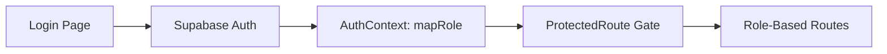
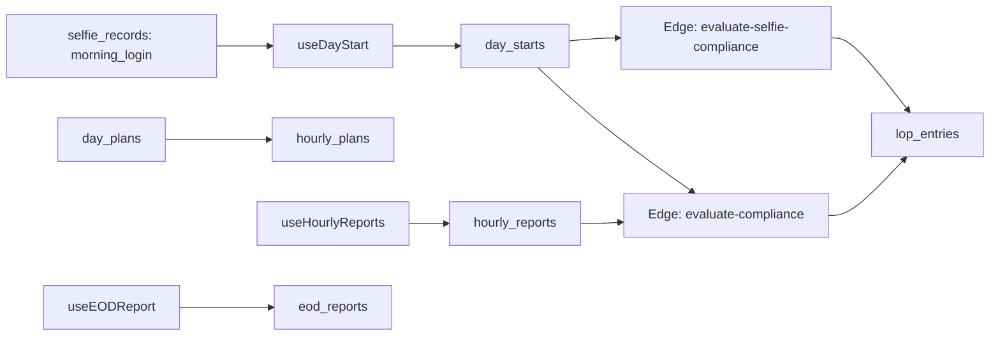
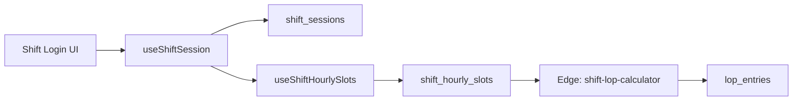
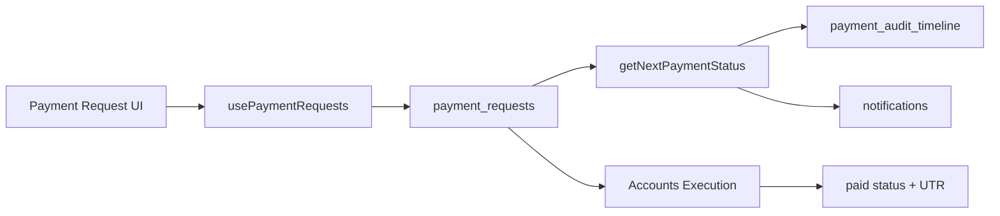
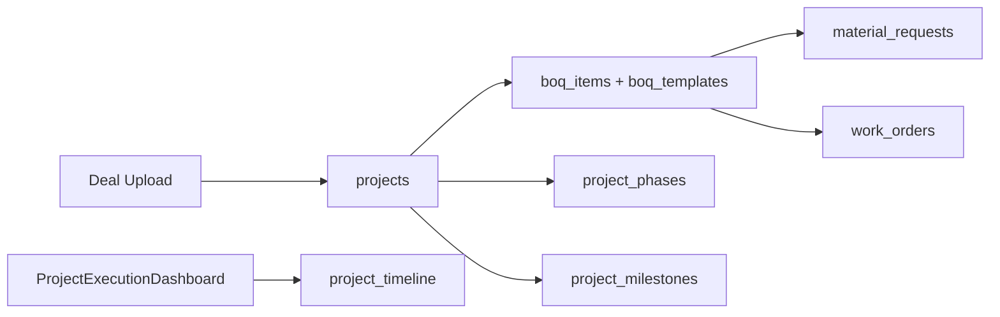
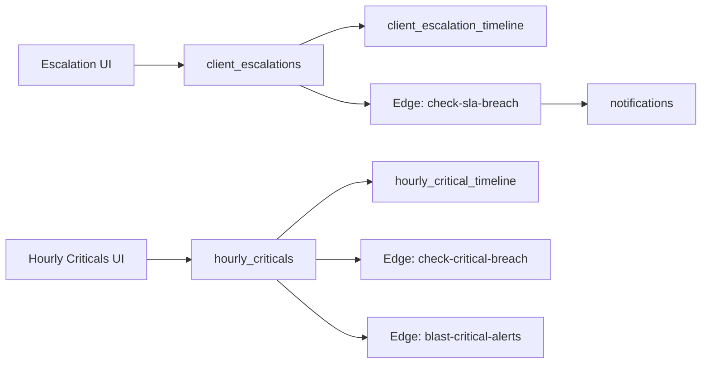
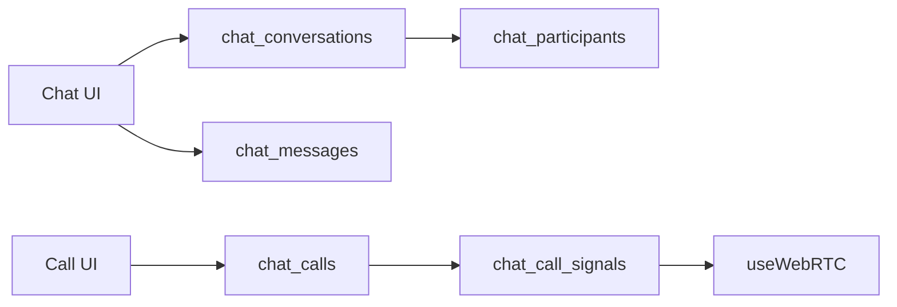
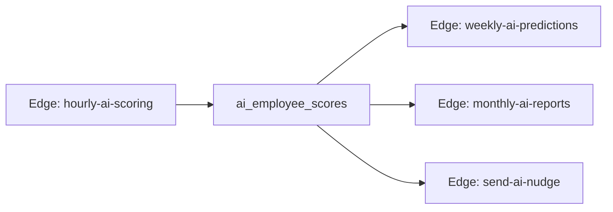

# IGO Chain Main - Detailed System Documentation (Web + Mobile)

Last reviewed: February 21, 2026

This document maps roles to pages, enumerates Supabase tables and RLS policies, lists edge function behaviors, and provides module flow diagrams derived from code.

Primary code references:
- `src/App.tsx`
- `src/contexts/AuthContext.tsx`
- `src/hooks/` (key domain hooks)
- `supabase/migrations/`
- `supabase/functions/`
- `mobile-app/src/`

---

## 1. Public Routes (No Auth Required)
- `/vendor/track/:accessToken`
- `/absent-locked`
- `/`
- `/login`
- `/employee-signup`
- `/gmo-dashboard`
- `/smo-dashboard`
- `/solver-dashboard`
- `/civil-projects`
- `/agri-projects`
- `*`

---

## 2. Role-to-Route Map (Protected Routes)

Notes:
- `AUTHENTICATED_ALL` means any authenticated user can access the route.
- Role normalization is defined in `src/contexts/AuthContext.tsx` (`mapRole`).
- Route permissions are defined in `src/App.tsx` via `ProtectedRoute` and `allowedRoles`.
**Role: accounts**
- `/accounts/reconciliation`
- `/accounts/rentals/payments`
- `/accounts-execution`
- `/dashboard/my-escalations`
- `/leave-request`
- `/my-requests`
- `/my-tasks`
- `/payment-request`
- `/payment-search`
- `/porter-payment`
- `/shift/break`
- `/shift/dashboard`
- `/shift/eod`
- `/shift/history`
- `/shift/hourly`
- `/shift/login`
- `/shift/logout`

**Role: admin**
- `/accounts/reconciliation`
- `/accounts/rentals/payments`
- `/accounts-execution`
- `/admin/ai-assistant`
- `/admin/ai-command-center`
- `/admin/attendance-roster`
- `/admin/criticals-audit`
- `/admin/crons`
- `/admin/escalation-closure`
- `/admin/fix-verticals`
- `/admin/geofencing`
- `/admin/lockouts`
- `/admin/notification-sounds`
- `/admin/payment-guardian`
- `/admin/payment-tags`
- `/admin/rental-categories`
- `/admin/rentals/setup`
- `/admin/shift-users`
- `/admin/week-off-management`
- `/admin-dashboard`
- `/admin-escalations`
- `/admin-lop`
- `/admin-orders`
- `/admin-payments`
- `/admin-queue`
- `/admin-rentals`
- `/announcements`
- `/attendance-calendar`
- `/audit-logs`
- `/dashboard/escalations`
- `/dashboard/my-escalations`
- `/departments`
- `/employee-activity`
- `/employee-directory`
- `/farm/dashboard`
- `/gmo/boq-approvals`
- `/gmo/new-deals`
- `/gmo/project-financials`
- `/inventory`
- `/leave-approvals`
- `/leave-request`
- `/management/intelligence`
- `/my-requests`
- `/my-tasks`
- `/nsm-dashboard`
- `/payment-request`
- `/payment-search`
- `/porter-payment`
- `/procurement-tracking`
- `/projects`
- `/projects/:projectId/edit`
- `/projects/command/:projectId`
- `/projects/execution/:projectId`
- `/projects/new`
- `/project-spending`
- `/purchase/dashboard`
- `/purchase-dashboard`
- `/rentals/:id/edit`
- `/rentals/new`
- `/role-management`
- `/rsh/escalations`
- `/selfie-attendance`
- `/shift/break`
- `/shift/dashboard`
- `/shift/eod`
- `/shift/history`
- `/shift/hourly`
- `/shift/login`
- `/shift/logout`
- `/site-manager/dashboard`
- `/smo/boq-approvals`
- `/sourcing-dashboard`
- `/system-docs`
- `/task-assignment`
- `/user-management`
- `/vendor-sourcing/dashboard`

**Role: auditor**
- `/admin/attendance-roster`
- `/admin-lop`
- `/attendance-calendar`
- `/audit-logs`
- `/auditor/payment-audit`
- `/auditor-dashboard`
- `/dashboard/my-escalations`
- `/employee-activity`
- `/employee-directory`
- `/inventory`
- `/lop-management`
- `/management/intelligence`
- `/nsm-dashboard`
- `/procurement-tracking`
- `/projects`
- `/selfie-attendance`
- `/shift/break`
- `/shift/dashboard`
- `/shift/eod`
- `/shift/history`
- `/shift/hourly`
- `/shift/login`
- `/shift/logout`

**Role: AUTHENTICATED_ALL**
- `/chat/*`
- `/company-calendar`
- `/day-plan`
- `/day-start`
- `/eod-summary`
- `/hourly-report`
- `/my-lop`
- `/profile`
- `/redirect`
- `/sandbox`

**Role: bd_data**
- `/leave-request`
- `/my-requests`
- `/my-tasks`
- `/payment-request`
- `/porter-payment`
- `/projects`
- `/projects/:projectId/edit`
- `/projects/new`

**Role: boi**
- `/ceo-dashboard`
- `/ceo-departments`
- `/ceo-intelligence`
- `/dashboard/boi`
- `/dashboard/boi/criticals-dispatch`
- `/dashboard/boi/escalation-dispatch`
- `/dashboard/boi/payments`
- `/dashboard/boi/site-visit-dispatch`
- `/dashboard/boi/tickets`
- `/dashboard/escalations`
- `/dashboard/my-escalations`
- `/employee-activity`
- `/leave-request`
- `/management/intelligence`
- `/my-requests`
- `/my-tasks`
- `/nsm-dashboard`
- `/payment-request`
- `/porter-payment`
- `/rsh/escalations`
- `/shift/break`
- `/shift/dashboard`
- `/shift/eod`
- `/shift/history`
- `/shift/hourly`
- `/shift/login`
- `/shift/logout`
- `/system-docs`
- `/task-assignment`

**Role: ceo**
- `/admin/attendance-roster`
- `/admin/fix-verticals`
- `/admin/geofencing`
- `/admin/payment-guardian`
- `/admin/payment-tags`
- `/admin/shift-users`
- `/admin/week-off-management`
- `/announcements`
- `/attendance-calendar`
- `/audit-logs`
- `/ceo/lop-reversals`
- `/ceo/materials`
- `/ceo/rentals/approvals`
- `/ceo/rentals/portfolio`
- `/ceo/work-orders`
- `/ceo-approvals`
- `/ceo-dashboard`
- `/ceo-departments`
- `/ceo-escalations`
- `/ceo-intelligence`
- `/dashboard/escalations`
- `/dashboard/my-escalations`
- `/departments`
- `/employee-activity`
- `/employee-directory`
- `/farm/dashboard`
- `/gmo/boq-approvals`
- `/gmo/new-deals`
- `/gmo/project-financials`
- `/inventory`
- `/leave-approvals`
- `/leave-request`
- `/management/intelligence`
- `/my-requests`
- `/my-tasks`
- `/nsm-dashboard`
- `/payment-request`
- `/payment-search`
- `/porter-payment`
- `/procurement-tracking`
- `/projects`
- `/projects/:projectId/edit`
- `/projects/command/:projectId`
- `/projects/execution/:projectId`
- `/projects/new`
- `/project-spending`
- `/purchase/dashboard`
- `/purchase-dashboard`
- `/role-management`
- `/rsh/escalations`
- `/site-manager/dashboard`
- `/sourcing-dashboard`
- `/system-docs`
- `/task-assignment`
- `/vendor-sourcing/dashboard`

**Role: data**
- `/dashboard/escalations`
- `/datateam-dashboard`
- `/leave-request`
- `/nsm-dashboard`
- `/shift/break`
- `/shift/dashboard`
- `/shift/eod`
- `/shift/history`
- `/shift/hourly`
- `/shift/login`
- `/shift/logout`

**Role: data_team**
- `/dashboard/escalations`
- `/datateam-dashboard`
- `/leave-request`
- `/nsm-dashboard`
- `/shift/break`
- `/shift/dashboard`
- `/shift/eod`
- `/shift/history`
- `/shift/hourly`
- `/shift/login`
- `/shift/logout`

**Role: datateam**
- `/dashboard/escalations`
- `/dashboard/my-escalations`
- `/datateam-dashboard`
- `/leave-request`
- `/my-requests`
- `/my-tasks`
- `/nsm-dashboard`
- `/payment-request`
- `/porter-payment`
- `/shift/break`
- `/shift/dashboard`
- `/shift/eod`
- `/shift/history`
- `/shift/hourly`
- `/shift/login`
- `/shift/logout`

**Role: director**
- `/dashboard/director`
- `/dashboard/my-escalations`
- `/leave-request`
- `/my-requests`
- `/my-tasks`
- `/payment-request`
- `/porter-payment`
- `/shift/break`
- `/shift/dashboard`
- `/shift/eod`
- `/shift/history`
- `/shift/hourly`
- `/shift/login`
- `/shift/logout`

**Role: employee**
- `/boq-builder`
- `/dashboard/my-escalations`
- `/deal-upload`
- `/employee-projects`
- `/engineer-dashboard`
- `/engineering/boq/:projectId`
- `/engineering/boq/:projectId/review`
- `/farm/dashboard`
- `/inventory`
- `/leave-request`
- `/my-requests`
- `/my-tasks`
- `/payment-request`
- `/porter-payment`
- `/projects`
- `/projects/:projectId/edit`
- `/projects/execution/:projectId`
- `/projects/new`
- `/purchase/dashboard`
- `/purchase-dashboard`
- `/rentals/:id/edit`
- `/rentals/bulk-raise`
- `/rentals/new`
- `/rsh/escalations`
- `/rsh/rentals`
- `/shift/break`
- `/shift/dashboard`
- `/shift/eod`
- `/shift/history`
- `/shift/hourly`
- `/shift/login`
- `/shift/logout`
- `/site-manager/dashboard`
- `/sourcing-dashboard`
- `/vendor-sourcing/dashboard`

**Role: farmmanager**
- `/shift/break`
- `/shift/dashboard`
- `/shift/eod`
- `/shift/history`
- `/shift/hourly`
- `/shift/login`
- `/shift/logout`

**Role: gm**
- `/accounts-execution`
- `/ceo-approvals`
- `/dashboard/escalations`
- `/dashboard/gm/payments`
- `/dashboard/my-escalations`
- `/employee-activity`
- `/farm/dashboard`
- `/gm-dashboard`
- `/gm-escalations`
- `/inventory`
- `/leave-request`
- `/my-requests`
- `/my-tasks`
- `/nsm-dashboard`
- `/payment-request`
- `/payment-search`
- `/porter-payment`
- `/procurement-tracking`
- `/projects`
- `/projects/command/:projectId`
- `/projects/execution/:projectId`
- `/project-spending`
- `/rsh/escalations`
- `/shift/break`
- `/shift/dashboard`
- `/shift/eod`
- `/shift/history`
- `/shift/hourly`
- `/shift/login`
- `/shift/logout`
- `/sourcing-dashboard`
- `/task-assignment`

**Role: gmo**
- `/dashboard/escalations`
- `/dashboard/gmo`
- `/dashboard/gmo/engineering-team`
- `/dashboard/gmo/payments`
- `/dashboard/gmo/projects`
- `/dashboard/gmo/tasks`
- `/dashboard/gmo/tickets`
- `/dashboard/my-escalations`
- `/farm/dashboard`
- `/gmo/boq-approvals`
- `/gmo/new-deals`
- `/gmo/project-financials`
- `/inventory`
- `/leave-request`
- `/my-requests`
- `/my-tasks`
- `/nsm-dashboard`
- `/payment-request`
- `/porter-payment`
- `/procurement-tracking`
- `/projects`
- `/projects/command/:projectId`
- `/projects/execution/:projectId`
- `/project-spending`
- `/shift/break`
- `/shift/dashboard`
- `/shift/eod`
- `/shift/history`
- `/shift/hourly`
- `/shift/login`
- `/shift/logout`
- `/sourcing-dashboard`
- `/system-docs`

**Role: hr**
- `/admin/attendance-roster`
- `/admin/rentals/setup`
- `/admin/week-off-management`
- `/attendance-calendar`
- `/dashboard/my-escalations`
- `/employee-activity`
- `/employee-directory`
- `/hr/payment-audit`
- `/hr/rentals`
- `/leave-approvals`
- `/leave-request`
- `/lop-management`
- `/management/intelligence`
- `/my-requests`
- `/my-tasks`
- `/payment-request`
- `/porter-payment`
- `/rentals/:id/edit`
- `/rentals/bulk-raise`
- `/rentals/new`
- `/rsh/escalations`
- `/rsh/rentals`
- `/selfie-attendance`
- `/shift/break`
- `/shift/dashboard`
- `/shift/eod`
- `/shift/history`
- `/shift/hourly`
- `/shift/login`
- `/shift/logout`

**Role: nsm**
- `/dashboard/escalations`
- `/dashboard/my-escalations`
- `/leave-request`
- `/my-requests`
- `/my-tasks`
- `/nsm-dashboard`
- `/payment-request`
- `/porter-payment`
- `/shift/break`
- `/shift/dashboard`
- `/shift/eod`
- `/shift/history`
- `/shift/hourly`
- `/shift/login`
- `/shift/logout`

**Role: purchase**
- `/dashboard/my-escalations`
- `/inventory`
- `/my-tasks`
- `/procurement-tracking`
- `/projects/execution/:projectId`
- `/purchase/dashboard`
- `/purchase-dashboard`
- `/sourcing-dashboard`
- `/vendor-sourcing/dashboard`

**Role: rsh**
- `/leave-request`
- `/my-requests`
- `/my-tasks`
- `/payment-request`
- `/porter-payment`
- `/rentals/:id/edit`
- `/rentals/bulk-raise`
- `/rentals/new`
- `/rsh/escalations`
- `/rsh/rentals`
- `/shift/break`
- `/shift/dashboard`
- `/shift/eod`
- `/shift/history`
- `/shift/hourly`
- `/shift/login`
- `/shift/logout`

**Role: smo**
- `/boq-builder`
- `/dashboard/escalations`
- `/dashboard/my-escalations`
- `/dashboard/smo`
- `/dashboard/smo/payments`
- `/dashboard/smo/projects`
- `/dashboard/smo/tasks`
- `/dashboard/smo/tickets`
- `/engineering/boq/:projectId`
- `/engineering/boq/:projectId/review`
- `/farm/dashboard`
- `/inventory`
- `/leave-request`
- `/my-requests`
- `/my-tasks`
- `/payment-request`
- `/porter-payment`
- `/procurement-tracking`
- `/projects`
- `/projects/execution/:projectId`
- `/shift/break`
- `/shift/dashboard`
- `/shift/eod`
- `/shift/history`
- `/shift/hourly`
- `/shift/login`
- `/shift/logout`
- `/smo/boq-approvals`
- `/sourcing-dashboard`
- `/system-docs`

**Role: vendor**
- `/dashboard/my-escalations`
- `/my-tasks`
- `/projects/execution/:projectId`
- `/purchase/dashboard`
- `/purchase-dashboard`
- `/sourcing-dashboard`
- `/vendor-sourcing/dashboard`

---

## 3. Supabase Edge Functions (Behavior + Tables Used)

Source: `supabase/functions/*/index.ts`
**Function: approve-leave**
- Summary: Leave approval workflow handler. Validates user via JWT, checks role, advances leave status across HR -> Admin -> CEO, writes audit notes.
- Tables: leave_requests, profiles
- RPCs: N/A

**Function: auto-mark-absent**
- Summary: Daily absent marking for non-shift users. Checks morning selfie, week-off, HR attestations; inserts LOP entries for absentees.
- Tables: hr_attestations, lop_entries, notifications, profiles, selfie_records, shift_user_assignments, week_off_assignments
- RPCs: N/A

**Function: blast-critical-alerts**
- Summary: 45-minute critical breach handler. Marks criticals as breached, logs timeline, notifies GM/Admin/CEO.
- Tables: hourly_critical_timeline, hourly_criticals, notifications, profiles
- RPCs: N/A

**Function: broadcast-calendar-event**
- Summary: Admin/CEO broadcast of holiday/event. Inserts notifications to all active users.
- Tables: notifications, profiles
- RPCs: N/A

**Function: check-critical-breach**
- Summary: Hourly critical SLA breach processor. Promotes to L3 CEO, sets blast flags, logs timeline, notifies GM/Admin/CEO.
- Tables: hourly_critical_timeline, hourly_criticals, notifications, profiles
- RPCs: N/A

**Function: check-sla-breach**
- Summary: Client escalation SLA escalator. Auto-advances L1 -> L2 -> L3, logs timeline, notifies new owners.
- Tables: client_escalation_timeline, client_escalations, notifications, profiles
- RPCs: N/A

**Function: create-user**
- Summary: Admin-only user creation. Creates auth user and upserts profile record.
- Tables: audit_logs, profiles
- RPCs: N/A

**Function: delete-user**
- Summary: Admin/CEO-only user deletion. Prevents self-delete, logs audit, disables or removes user.
- Tables: audit_logs, profiles
- RPCs: N/A

**Function: duplicate-payment-detector**
- Summary: Payment duplicate detection. Creates fingerprints for vendor/account/UPI/bill URL and returns matches from dedup registry.
- Tables: payment_deduplication_registry, payment_requests
- RPCs: N/A

**Function: erp-intelligence**
- Summary: Admin AI assistant with data tools (attendance, payments, escalations, projects). Queries Supabase and feeds model.
- Tables: client_escalations, day_starts, hourly_criticals, payment_requests, profiles, projects
- RPCs: N/A

**Function: evaluate-compliance**
- Summary: Nightly login-time compliance for non-shift users. Creates LOP entries based on late login thresholds.
- Tables: day_starts, lop_entries, notifications, profiles, shift_user_assignments
- RPCs: N/A

**Function: evaluate-employee-compliance**
- Summary: AI daily compliance scorer. Aggregates day plan, reports, selfies, EOD and writes AI score + status.
- Tables: ai_config, ai_usage_logs
- RPCs: N/A

**Function: evaluate-selfie-compliance**
- Summary: Daily selfie compliance checker. Late/missing selfie -> 0.25 LOP (non-shift users).
- Tables: lop_entries, notifications, profiles, selfie_records, shift_user_assignments
- RPCs: N/A

**Function: hourly-ai-scoring**
- Summary: Hourly AI scoring during work hours. Checks kill switch, active users, computes AI score.
- Tables: ai_config, ai_employee_scores, day_plans, eod_reports, hourly_plans, hourly_reports, profiles, selfie_records
- RPCs: N/A

**Function: intelligence-analyze**
- Summary: AI analysis for unified activity snapshots (overview/department/individuals/recommendations).
- Tables: N/A
- RPCs: N/A

**Function: monthly-ai-reports**
- Summary: Monthly AI report generator from ai_employee_scores.
- Tables: ai_employee_scores, ai_monthly_reports, profiles
- RPCs: N/A

**Function: payment-pattern-analyzer**
- Summary: Fraud/pattern detector on recent payments. Creates alerts for high-frequency, vendor bursts, round amounts, etc.
- Tables: audit_logs, fraud_pattern_alerts, notifications, payment_requests, profiles
- RPCs: N/A

**Function: send-ai-nudge**
- Summary: AI-generated nudges for employees/managers based on current score and missing items.
- Tables: ai_nudges
- RPCs: N/A

**Function: shift-lop-calculator**
- Summary: Daily shift-user LOP processor. Checks shift sessions and hourly slots; applies LOPs for missing login or missing reports.
- Tables: audit_logs, lop_entries, notifications, profiles, shift_hourly_slots, shift_sessions, shift_user_assignments, week_off_assignments
- RPCs: N/A

**Function: weekly-ai-predictions**
- Summary: Weekly AI predictions from ai_employee_scores with org trend + at-risk list.
- Tables: ai_employee_scores, ai_weekly_predictions, profiles
- RPCs: N/A

---

## 4. Supabase Tables (From Migrations)

Source: `supabase/migrations/*.sql`
| Table | Migrations |
| --- | --- |
| `bulk_batches` | 20260202_enterprise_payment_schema.sql |
| `daily_expense_sheet` | 20260203103304_fc590e74-b1e7-468d-aa6e-716a120f4e70.sql |
| `daily_site_updates` | 20260110102519_d4607af0-e776-4c54-bfd6-9682a3b00fd7.sql |
| `material_requests` | 20260110102519_d4607af0-e776-4c54-bfd6-9682a3b00fd7.sql |
| `payment_audit_logs` | 20260202_enterprise_payment_schema.sql |
| `procurement_timeline` | 20260110122014_4fa56a08-d45f-484c-be49-fdd5a7ffa00e.sql |
| `project_boq` | 20260110073115_770b1cba-9a64-40f4-bb4b-1154b78a06fd.sql |
| `project_execution_proofs` | 20260110073115_770b1cba-9a64-40f4-bb4b-1154b78a06fd.sql |
| `project_phases` | 20260110073115_770b1cba-9a64-40f4-bb4b-1154b78a06fd.sql |
| `project_timeline` | 20260110073115_770b1cba-9a64-40f4-bb4b-1154b78a06fd.sql |
| `project_verticals` | 20260110073115_770b1cba-9a64-40f4-bb4b-1154b78a06fd.sql |
| `public.ai_config` | 20260210000000_create_ai_command_center_schema.sql |
| `public.ai_usage_logs` | 20260210000000_create_ai_command_center_schema.sql |
| `public.announcements` | 20260102142325_6d2b2710-e288-4822-bac9-3d8e9f4153e4.sql |
| `public.audit_logs` | 20251227103806_5f716b1f-25b5-4055-9410-43d602a569ab.sql |
| `public.boq_template_items` | 20260112130346_dce03270-2a81-4772-8e70-bbed94528a1a.sql |
| `public.boq_templates` | 20260112130346_dce03270-2a81-4772-8e70-bbed94528a1a.sql |
| `public.chat_activity` | 20260220_chat_v2_updates.sql |
| `public.chat_call_signals` | 20260220_chat_v4_webrtc.sql, 20260221_chat_call_signals.sql, 20260221_chat_final_stabilization.sql |
| `public.chat_calls` | 20260220_chat_v3_calls.sql |
| `public.chat_connections` | 20260220_chat_v2_updates.sql |
| `public.chat_conversations` | 20260220_chat_system_final.sql, 20260220_create_chat_schema.sql |
| `public.chat_message_reactions` | 20260220_chat_system_final.sql, 20260220_create_chat_schema.sql |
| `public.chat_messages` | 20260220_chat_system_final.sql, 20260220_create_chat_schema.sql |
| `public.chat_participants` | 20260220_chat_system_final.sql, 20260220_create_chat_schema.sql |
| `public.client_escalation_timeline` | 20260102152859_ea951d99-3fd1-4edb-a1a1-961a8f59a40a.sql |
| `public.client_escalations` | 20260102152859_ea951d99-3fd1-4edb-a1a1-961a8f59a40a.sql |
| `public.company_calendar` | 20260108073204_caf8b475-68fb-4969-80d5-3fa6b906476c.sql |
| `public.cultivation_cycles` | 20260112073412_08164ec3-59ea-4f85-a3a6-38eef8ab3ae5.sql |
| `public.daily_farm_logs` | 20260112073412_08164ec3-59ea-4f85-a3a6-38eef8ab3ae5.sql |
| `public.day_plans` | 20251227080442_c2e8d675-9bd3-4e2a-9367-76d4f9e65f4c.sql |
| `public.departments` | 20260213140000_create_departments_table.sql |
| `public.discipline_scores` | 20251227080442_c2e8d675-9bd3-4e2a-9367-76d4f9e65f4c.sql |
| `public.escalation_timeline` | 20251231054101_a3da8991-57e5-4554-b039-9c05189b3df7.sql |
| `public.escalations` | 20251231054101_a3da8991-57e5-4554-b039-9c05189b3df7.sql |
| `public.extra_work_entries` | 20260102135606_8981e0b4-c464-4b86-9297-7fef19af02e0.sql |
| `public.farm_manager_remarks` | 20260112073412_08164ec3-59ea-4f85-a3a6-38eef8ab3ae5.sql |
| `public.geofences` | 20260201000000_add_geofencing_module.sql |
| `public.harvest_records` | 20260112073412_08164ec3-59ea-4f85-a3a6-38eef8ab3ae5.sql |
| `public.hourly_critical_timeline` | 20260102152859_ea951d99-3fd1-4edb-a1a1-961a8f59a40a.sql |
| `public.hourly_criticals` | 20260102152859_ea951d99-3fd1-4edb-a1a1-961a8f59a40a.sql |
| `public.inventory_usage_logs` | 20260113065344_e6e584c6-495a-4dae-84a8-8cbf45611959.sql |
| `public.leave_requests` | 20260102142325_6d2b2710-e288-4822-bac9-3d8e9f4153e4.sql |
| `public.leave_types` | 20260102142325_6d2b2710-e288-4822-bac9-3d8e9f4153e4.sql |
| `public.lop_audit_logs` | 20260108073204_caf8b475-68fb-4969-80d5-3fa6b906476c.sql |
| `public.lop_entries` | 20260102142325_6d2b2710-e288-4822-bac9-3d8e9f4153e4.sql |
| `public.milestone_deviation_requests` | 20260111035127_ee9427b4-9d3e-4e15-a351-08befa21fece.sql |
| `public.payment_requests` | 20251227080442_c2e8d675-9bd3-4e2a-9367-76d4f9e65f4c.sql |
| `public.payment_tags` | 20260205062900_98209af2-f77c-451e-8323-244f8c78e6e0.sql |
| `public.project_inventory` | 20260113065344_e6e584c6-495a-4dae-84a8-8cbf45611959.sql |
| `public.project_milestones` | 20260111035127_ee9427b4-9d3e-4e15-a351-08befa21fece.sql |
| `public.project_variations` | 20260214_create_project_variations.sql |
| `public.projects` | 20251227103806_5f716b1f-25b5-4055-9410-43d602a569ab.sql |
| `public.purchase_orders` | 20251230083946_c2cf6614-5009-4a8d-bf3e-9a8d49541db1.sql |
| `public.purchase_progress_logs` | 20260111043603_8f2f5eaa-45f5-4605-999a-282282d7502b.sql |
| `public.rental_expenses` | 20260130_rental_enhancements.sql |
| `public.selfie_records` | 20260102065616_569083a6-c7cc-422f-89d9-9ea9febb532e.sql |
| `public.shift_assignment_history` | 20260130_create_shift_tables.sql |
| `public.shift_breaks` | 20260130_create_shift_sessions_schema.sql |
| `public.shift_eod_reports` | 20260130_create_shift_sessions_schema.sql |
| `public.shift_hourly_slots` | 20260130_create_shift_sessions_schema.sql |
| `public.shift_sessions` | 20260130_create_shift_sessions_schema.sql |
| `public.shift_user_assignments` | 20260130_create_shift_tables.sql |
| `public.site_visit_escalations` | 20260206_rsh_site_visit_escalations.sql |
| `public.split_payments` | 20260220_enhanced_split_payments.sql |
| `public.system_settings` | 20260213150000_create_system_settings.sql |
| `public.task_assignments` | 20260102142325_6d2b2710-e288-4822-bac9-3d8e9f4153e4.sql |
| `public.task_comments` | 20260102142325_6d2b2710-e288-4822-bac9-3d8e9f4153e4.sql |
| `public.travel_claims` | 20260204113540_c6be9130-f370-4b1d-9c04-bcbc117e7299.sql |
| `public.travel_rate_config` | 20260204113540_c6be9130-f370-4b1d-9c04-bcbc117e7299.sql |
| `public.travel_requests` | 20260204113540_c6be9130-f370-4b1d-9c04-bcbc117e7299.sql |
| `public.trip_route_logs` | 20260204113540_c6be9130-f370-4b1d-9c04-bcbc117e7299.sql |
| `public.user_location_logs` | 20260201000000_add_geofencing_module.sql |
| `public.vendor_master` | 20260112122119_e429b202-becd-4504-be87-adde06e69fb1.sql |
| `public.vendor_ratings` | 20260116053013_25642c54-5265-441d-9a10-a8be62291e7f.sql |
| `public.vendor_sourcing_logs` | 20260112122119_e429b202-becd-4504-be87-adde06e69fb1.sql |
| `public.work_order_payments` | 20260116141837_1b62d3ec-a597-40ec-b366-641e30530f70.sql |
| `public.work_orders` | 20251230083946_c2cf6614-5009-4a8d-bf3e-9a8d49541db1.sql |
| `rental_additions` | 20260202_rental_logic_update.sql |
| `rental_property_remarks` | 20260202_property_remarks.sql |
| `vendor_quotes` | 20260110102519_d4607af0-e776-4c54-bfd6-9682a3b00fd7.sql |
| `vendor_work_requests` | 20260110102519_d4607af0-e776-4c54-bfd6-9682a3b00fd7.sql |
| `week_off_assignments` | 20260125_create_week_off_assignments.sql |

---

## 5. RLS Policies by Table (From Migrations)

Source: `supabase/migrations/*.sql`
| Table | Policies | Migrations |
| --- | --- | --- |
| `bulk_batches` | Enable insert for Accounts and Admin; Enable read access for internal users; Enable update for Accounts, Admin, CEO | 20260202_enterprise_payment_schema.sql |
| `client_escalations` | Authenticated users can view all escalations; Realtime Select | 20260104150044_5fafb27a-4129-4c33-8191-1996347d6df6.sql, 20260105073237_5bbd85f4-4647-44fd-9730-4b7a4accd34c.sql |
| `daily_expense_sheet` | Insert daily expenses for admin; View daily expenses for authorized roles | 20260203103304_fc590e74-b1e7-468d-aa6e-716a120f4e70.sql |
| `daily_site_updates` | Site managers can create updates; Site managers can update their reports; Team can view site updates | 20260110102519_d4607af0-e776-4c54-bfd6-9682a3b00fd7.sql |
| `day_starts` | day_starts_select_policy | 20260106054505_daae0d09-a9db-43c9-b8dd-6ddcdb31ed9b.sql |
| `geofences` | Admins can manage geofences | 20260201_fix_admin_rls_casing.sql |
| `hourly_criticals` | Authenticated users can view all criticals; Realtime Select | 20260104150044_5fafb27a-4129-4c33-8191-1996347d6df6.sql, 20260105073259_710e0486-1557-4f36-acf8-92ce06fd2fb9.sql |
| `hourly_plans` | hourly_plans_select_policy | 20260106054505_daae0d09-a9db-43c9-b8dd-6ddcdb31ed9b.sql |
| `hourly_reports` | hourly_reports_select_policy | 20260106054505_daae0d09-a9db-43c9-b8dd-6ddcdb31ed9b.sql |
| `leave_requests` | leave_insert_policy; leave_select_policy; leave_update_policy | 20260106054505_daae0d09-a9db-43c9-b8dd-6ddcdb31ed9b.sql |
| `lop_entries` | Admin can verify LOP entries; CEO can approve LOP entries; HR can create LOP entries; HR can delete pending LOP entries; LOP entries deletable by ceo; LOP entries insertable by elevated roles; LOP entries updatable by elevated roles; LOP entries viewable by elevated roles and own; lop_delete_admin; lop_insert_hr_boi; lop_select_elevated_roles; lop_update_chain; View LOP entries | 20260104021723_942fba63-0f90-4dfe-8ffc-f467573ba9b4.sql, 20260106054505_daae0d09-a9db-43c9-b8dd-6ddcdb31ed9b.sql, 20260108073204_caf8b475-68fb-4969-80d5-3fa6b906476c.sql |
| `material_requests` | Authorized users can update material requests; Engineers can create material requests; Farm manager can create material requests; GM can update material requests; Team can view material requests | 20260110102519_d4607af0-e776-4c54-bfd6-9682a3b00fd7.sql, 20260116053442_95237170-872f-4b68-9e6c-b9d29370a9a8.sql, 20260214_replace_boi_with_gm.sql |
| `payment_audit_logs` | System can insert audit logs; View audit logs for Admin/CEO/Auditor | 20260202_enterprise_payment_schema.sql |
| `payment_requests` | Accounts can convert batch to direct; Authenticated users can view payment requests; Service role payment requests access; Users can create payment requests; Users can update own requests; Users can update payment requests; Users can view own payment requests | 20260120_security_remediation.sql, 20260206_batch_to_direct_conversion.sql, 20260219_fix_payment_department_constraint.sql, 20260219_fix_payment_rls_history.sql |
| `procurement_timeline` | Authenticated users can insert to procurement timeline; Authenticated users can view procurement timeline | 20260110122014_4fa56a08-d45f-484c-be49-fdd5a7ffa00e.sql |
| `profiles` | Authenticated users can view all profiles; Service role full access; Users can update own profile | 20260120_security_remediation.sql |
| `project_boq` | Engineers can manage BOQ for assigned projects; Executives can manage all BOQ; Executives can view all BOQ | 20260110073115_770b1cba-9a64-40f4-bb4b-1154b78a06fd.sql, 20260110102519_d4607af0-e776-4c54-bfd6-9682a3b00fd7.sql |
| `project_execution_proofs` | Anyone can view proofs; Team can upload proofs | 20260110073115_770b1cba-9a64-40f4-bb4b-1154b78a06fd.sql |
| `project_inventory` | Authenticated users can view inventory; Restricted roles can insert inventory; Restricted roles can update inventory; Service role inventory access | 20260120_security_remediation.sql |
| `project_phases` | Executives can manage all phases; Executives can view all phases; Team can manage phases for assigned projects | 20260110073115_770b1cba-9a64-40f4-bb4b-1154b78a06fd.sql, 20260110102519_d4607af0-e776-4c54-bfd6-9682a3b00fd7.sql |
| `project_timeline` | Anyone authenticated can insert timeline; Executives can view timeline | 20260110073115_770b1cba-9a64-40f4-bb4b-1154b78a06fd.sql |
| `project_verticals` | Admin can manage verticals; Anyone can view active verticals | 20260110073115_770b1cba-9a64-40f4-bb4b-1154b78a06fd.sql |
| `public.ai_config` | Admin full access to ai_config | 20260210000000_create_ai_command_center_schema.sql |
| `public.ai_usage_logs` | Admin read access to ai_usage_logs; Service role can insert ai_usage_logs | 20260210000000_create_ai_command_center_schema.sql |
| `public.announcements` | Admin/CEO can manage announcements; All users can view active announcements; Announcements access policy | 20260102142325_6d2b2710-e288-4822-bac9-3d8e9f4153e4.sql, 20260103134303_01b2e320-e21c-4e48-9df3-76637b3e1658.sql |
| `public.audit_logs` | Admin and CEO can view audit logs; Admin can delete audit logs; Admins and auditors can view audit logs; CEO can view audit logs; Management only audit logs; System can insert audit logs | 20251227103806_5f716b1f-25b5-4055-9410-43d602a569ab.sql, 20260103033655_156d3ffa-183b-4301-b2ad-3118ef8e2573.sql, 20260103064508_ab8f8253-e87c-41c4-9592-c0b5d4202f50.sql, 20260103125357_04245560-534f-4161-8edc-4352d261be64.sql, 20260104184236_255acc43-b7af-40b7-8a99-e3c0ff330ff4.sql, 20260205125018_a3f62ab6-cd63-43ff-8410-f1d13cbba4fb.sql, 20260218_EMERGENCY_RECOVERY.sql, 20260218_security_hardening.sql, 20260220_fix_all_rls_case_sensitivity.sql |
| `public.boq_template_items` | Admin and engineering roles can manage template items; All authenticated users can view template items | 20260112130346_dce03270-2a81-4772-8e70-bbed94528a1a.sql |
| `public.boq_templates` | Admin and engineering roles can manage templates; All authenticated users can view templates | 20260112130346_dce03270-2a81-4772-8e70-bbed94528a1a.sql |
| `public.bulk_batches` | Bulk Batches Delete Admin; Bulk Batches Delete Permitted; Bulk Batches Insert; Bulk batches strict access; Bulk Batches Update; Bulk Batches View Permitted | 20260203121248_6cf405c2-b61e-49dd-bd76-d977ec63d544.sql, 20260203121447_fc701617-03de-471e-84e4-27750063272a.sql, 20260203130424_0126f068-3e79-4428-8226-aed37da68f42.sql, 20260205100955_1be06a39-cbde-407a-b3fb-a458217dcbea.sql, 20260205130259_b8bf6d2c-2243-4c29-b589-f72f63832e7d.sql |
| `public.chat_activity` | Users can update their own activity; Users can view their own activity | 20260220_chat_v2_updates.sql |
| `public.chat_call_signals` | Users can insert their own signals; Users can read signals for their calls; Users can send signals; Users can view signals for their calls | 20260220_chat_v4_webrtc.sql, 20260221_chat_call_signals.sql, 20260221_chat_final_stabilization.sql |
| `public.chat_calls` | Users can delete their own calls; Users can initiate calls; Users can update their calls; Users can update their own calls; Users can view calls they are part of; Users can view their own calls | 20260220_chat_v3_calls.sql, 20260221_fix_chat_calls_rls.sql |
| `public.chat_connections` | Users can initiate connection requests; Users can update their received connection requests; Users can view their own connections | 20260220_chat_v2_updates.sql |
| `public.chat_conversations` | Admins and creators can delete conversations; Admins and creators can update conversations; Users can create conversations; Users can update conversations they are participants in; Users can view conversations they participate in | 20260220_chat_group_restrictions.sql, 20260220_chat_system_final.sql, 20260220_create_chat_schema.sql |
| `public.chat_message_reactions` | Users can add reactions; Users can remove their own reactions; Users can view reactions in their conversations | 20260220_create_chat_schema.sql |
| `public.chat_messages` | Users can delete messages in their conversations; Users can insert messages in their conversations; Users can update their own messages; Users can update/delete their own messages; Users can view messages in their conversations | 20260220_chat_system_final.sql, 20260220_create_chat_schema.sql, 20260221_fix_chat_calls_rls.sql |
| `public.chat_participants` | Admins can remove participants; Participants can update their own status; Users can add participants to conversations; Users can update their own participant details; Users can view participants of their conversations | 20260220_chat_system_final.sql, 20260220_create_chat_schema.sql |
| `public.client_escalation_timeline` | Timeline insert for client escalations; Timeline select for client escalations | 20260102152859_ea951d99-3fd1-4edb-a1a1-961a8f59a40a.sql |
| `public.client_escalations` | Admin can close escalations; Admin can delete client escalations; Authorized roles can create escalations; BOI can assign escalations; Client escalations need-to-know access; GM Admin CEO can update client escalations; NSM can create client escalations; Relevant users can view client escalations; RSH can create site visit escalations; Solvers can acknowledge and update; Solvers can update assigned escalations; Solvers can update client escalations; Users can view assigned or department escalations; Users can view client escalations | 20260102152859_ea951d99-3fd1-4edb-a1a1-961a8f59a40a.sql, 20260103061956_f6184d4b-0a92-4b51-8ff4-c3be671bb33f.sql, 20260103134303_01b2e320-e21c-4e48-9df3-76637b3e1658.sql, 20260104121139_42ebb64c-ed15-4d83-8639-2ad977de488d.sql, 20260104130502_7ab5d916-2513-4418-b07c-b1f025a626d1.sql, 20260104184236_255acc43-b7af-40b7-8a99-e3c0ff330ff4.sql, 20260122000000_refined_escalation_system.sql, 20260205130259_b8bf6d2c-2243-4c29-b589-f72f63832e7d.sql, 20260206_unify_escalations.sql |
| `public.company_calendar` | Calendar editable by admin/ceo; Calendar editable by elevated roles; Calendar viewable by all authenticated | 20260108073204_caf8b475-68fb-4969-80d5-3fa6b906476c.sql, 20260108100217_630bbc3f-81a4-470e-a59c-abef470ab7ea.sql |
| `public.cultivation_cycles` | Authenticated users can create cultivation cycles; Users can delete their own cycles; Users can update their own cycles or managers can update; Users can view cultivation cycles | 20260112073412_08164ec3-59ea-4f85-a3a6-38eef8ab3ae5.sql |
| `public.daily_expense_sheet` | Insert daily expenses for permitted roles; View daily expenses for authorized roles | 20260205101034_53b01d94-2b13-4899-b3f3-dc9acb505f2d.sql |
| `public.daily_farm_logs` | Authenticated users can create farm logs; Users can delete their own farm logs; Users can update farm logs; Users can view farm logs | 20260112073412_08164ec3-59ea-4f85-a3a6-38eef8ab3ae5.sql |
| `public.day_plans` | Users can create own day plans; Users can view all day plans for authorized roles; Users can view own day plans; Users can view relevant day plans | 20251227080442_c2e8d675-9bd3-4e2a-9367-76d4f9e65f4c.sql, 20260101073625_6bbe1da2-280e-4f2c-b20e-d1748f7b0a6c.sql, 20260106044939_fb15721c-0288-42dc-a4bc-e82605c9b346.sql, 20260214_fix_day_plans_rls_management.sql, 20260220_fix_all_rls_final_cleanup.sql |
| `public.day_starts` | Users can view own day starts; Users can view relevant day starts | 20260106044939_fb15721c-0288-42dc-a4bc-e82605c9b346.sql, 20260214_fix_day_plans_rls_management.sql, 20260220_fix_all_rls_case_sensitivity.sql |
| `public.departments` | Admins and CEO can manage departments; Departments are viewable by everyone | 20260213140000_create_departments_table.sql |
| `public.discipline_scores` | System can insert discipline scores; System can update discipline scores; Users can view own discipline scores | 20251227080442_c2e8d675-9bd3-4e2a-9367-76d4f9e65f4c.sql, 20260101073625_6bbe1da2-280e-4f2c-b20e-d1748f7b0a6c.sql |
| `public.eod_reports` | Users can view own eod reports; Users can view relevant eod reports | 20260106044939_fb15721c-0288-42dc-a4bc-e82605c9b346.sql, 20260214_fix_day_plans_rls_management.sql, 20260220_fix_all_rls_final_cleanup.sql |
| `public.escalation_timeline` | Elevated roles can view timeline; System can insert timeline | 20251231054101_a3da8991-57e5-4554-b039-9c05189b3df7.sql |
| `public.escalations` | Admin can delete escalations; Elevated roles can view escalations; GM can update escalations; SMO can create escalations; Users can view relevant escalations | 20251231054101_a3da8991-57e5-4554-b039-9c05189b3df7.sql, 20251231083203_12785e49-cf52-43fc-9f40-1d58a88eabe9.sql, 20260101073218_3627f86f-9f1f-4c64-88f4-30e9cd49ae81.sql, 20260101073625_6bbe1da2-280e-4f2c-b20e-d1748f7b0a6c.sql, 20260104184236_255acc43-b7af-40b7-8a99-e3c0ff330ff4.sql |
| `public.extra_work_entries` | Users can delete own extra work entries same day; Users can insert own extra work entries; Users can view relevant extra work entries | 20260102135606_8981e0b4-c464-4b86-9297-7fef19af02e0.sql, 20260103134303_01b2e320-e21c-4e48-9df3-76637b3e1658.sql |
| `public.farm_manager_remarks` | Authenticated users can create remarks; Users can delete their own remarks; Users can update their own remarks; Users can view remarks | 20260112073412_08164ec3-59ea-4f85-a3a6-38eef8ab3ae5.sql |
| `public.geofence_zones` | Admin manage all geofences; Geofence zones visible to relevant roles | 20260205125619_6e163f88-8f3e-46c2-95f9-358911cc8ad9.sql, 20260220_fix_all_rls_case_sensitivity.sql, 20260220_fix_all_rls_final_cleanup.sql |
| `public.geofences` | Admins can manage geofences; Authenticated users can view defined geofences; Authenticated users can view geofences; Geofences visible to relevant roles | 20260201000000_add_geofencing_module.sql, 20260205125018_a3f62ab6-cd63-43ff-8410-f1d13cbba4fb.sql, 20260205125619_6e163f88-8f3e-46c2-95f9-358911cc8ad9.sql |
| `public.harvest_records` | Authenticated users can create harvest records; Users can delete their own harvest records; Users can update harvest records; Users can view harvest records | 20260112073412_08164ec3-59ea-4f85-a3a6-38eef8ab3ae5.sql |
| `public.hourly_critical_timeline` | Timeline insert for hourly criticals; Timeline select for hourly criticals | 20260102152859_ea951d99-3fd1-4edb-a1a1-961a8f59a40a.sql |
| `public.hourly_criticals` | Admin can audit close criticals; Admin can delete hourly criticals; BOI can assign criticals; Data team can create criticals; Data team can create hourly criticals; GM Admin CEO can update hourly criticals; Hourly criticals need-to-know access; Relevant users can view hourly criticals; Solvers can update assigned criticals; Solvers can update hourly criticals; Users can view hourly criticals | 20260102152859_ea951d99-3fd1-4edb-a1a1-961a8f59a40a.sql, 20260103134303_01b2e320-e21c-4e48-9df3-76637b3e1658.sql, 20260104121139_42ebb64c-ed15-4d83-8639-2ad977de488d.sql, 20260104130502_7ab5d916-2513-4418-b07c-b1f025a626d1.sql, 20260118053150_e62d8e49-fb64-4522-9096-dba171832cfd.sql, 20260122000000_refined_escalation_system.sql, 20260205130259_b8bf6d2c-2243-4c29-b589-f72f63832e7d.sql |
| `public.hourly_plans` | Users can view relevant hourly plans | 20260106044939_fb15721c-0288-42dc-a4bc-e82605c9b346.sql |
| `public.hourly_reports` | Users can view relevant hourly reports | 20260106044939_fb15721c-0288-42dc-a4bc-e82605c9b346.sql, 20260220_fix_all_rls_case_sensitivity.sql |
| `public.hr_attestations` | HR and Admin can insert attestations; HR and Admin can update attestations; HR can insert attestations; HR can update attestations; Users can view relevant attestations | 20251230082337_5bd42764-6e35-4fea-a0e9-77612568b025.sql, 20260103062907_52b2d2e5-c971-49a0-aaf3-37f1229eb5e7.sql, 20260103063417_0735e278-3ceb-4714-8862-aed156a0ed82.sql |
| `public.inventory_usage_logs` | Authenticated users can insert usage logs; Users can view usage logs | 20260113065344_e6e584c6-495a-4dae-84a8-8cbf45611959.sql |
| `public.leave_requests` | Authorized roles can update leave requests; Employees can create own leave requests; HR can update pending_hr requests; Leave requests insert secure; Leave requests need-to-know; Leave requests update secure; leave_insert_simple; leave_requests_full_update_policy; leave_select_simple; leave_update_policy; leave_update_simple; Users can view relevant leave requests | 20260102142325_6d2b2710-e288-4822-bac9-3d8e9f4153e4.sql, 20260103134303_01b2e320-e21c-4e48-9df3-76637b3e1658.sql, 20260104183622_b4bdfea3-0753-462f-b0e4-5bba47cb18b5.sql, 20260106072615_acdebcab-b264-49f8-994b-b807516b0896.sql, 20260106073334_5266b538-9749-4b88-b8e3-883b70c3129b.sql, 20260106075944_8eca1355-12b2-4cd4-87f2-5b6db912b5e2.sql, 20260205130259_b8bf6d2c-2243-4c29-b589-f72f63832e7d.sql, 20260205130509_bf3690e1-66ac-43a7-91e4-5254656e4abf.sql |
| `public.leave_types` | All authenticated users can view leave types; HR and Admin can manage leave types; Leave types access policy | 20260102142325_6d2b2710-e288-4822-bac9-3d8e9f4153e4.sql, 20260103134303_01b2e320-e21c-4e48-9df3-76637b3e1658.sql |
| `public.live_locations` | Live locations strict access; Users update own live location secure | 20260205130509_bf3690e1-66ac-43a7-91e4-5254656e4abf.sql |
| `public.location_logs` | Location logs strict access; Users can view own location logs or admins can view all | 20260205125619_6e163f88-8f3e-46c2-95f9-358911cc8ad9.sql, 20260205130259_b8bf6d2c-2243-4c29-b589-f72f63832e7d.sql |
| `public.lop_audit_logs` | Audit logs viewable by elevated roles; Only CEO can insert audit logs | 20260108073204_caf8b475-68fb-4969-80d5-3fa6b906476c.sql |
| `public.lop_entries` | Admin can review LOP reversal requests; BOI can review LOP reversal requests; CEO can approve LOP reversal requests; CEO can update LOP status; Employees and management can view LOP entries; Employees can request reversal; Employees can request reversal on own LOP entries; Employees can view own LOP entries; HR and BOI can manage LOP entries; HR can manage LOP entries; HR, BOI, and Admin can fully manage LOP entries; LOP entries insert secure; LOP entries need-to-know; LOP entries update secure; lop_delete_admin; lop_insert_hr_boi; lop_select_elevated_roles; lop_update_chain | 20260102142325_6d2b2710-e288-4822-bac9-3d8e9f4153e4.sql, 20260103134303_01b2e320-e21c-4e48-9df3-76637b3e1658.sql, 20260108100217_630bbc3f-81a4-470e-a59c-abef470ab7ea.sql, 20260108101210_3df8d518-f846-4cbd-94d7-ed0cdf8e8fd1.sql, 20260108102104_8623f39e-fac4-4897-8da5-d321195d55f5.sql, 20260108105059_2fab84c7-64fa-4af4-ad85-faac2304160a.sql, 20260124_add_auditor_lop_access.sql, 20260129_add_lop_reversal_schema.sql, 20260205130259_b8bf6d2c-2243-4c29-b589-f72f63832e7d.sql, 20260205130509_bf3690e1-66ac-43a7-91e4-5254656e4abf.sql, 20260220_fix_all_rls_case_sensitivity.sql, 20260220_fix_all_rls_final_cleanup.sql |
| `public.material_requests` | Authorized users can update material requests; Engineering department can create material requests; Management can view material requests; Users can create material requests; Users can update relevant material requests | 20260116084947_667b2ad8-e046-405d-a9b6-7a5a0a7bef7c.sql, 20260218_EMERGENCY_RECOVERY.sql, 20260218_fix_material_request_governance.sql, 20260220_fix_all_rls_case_sensitivity.sql |
| `public.milestone_deviation_requests` | Approvers can update deviation requests; Engineers can create deviation requests; Team can view deviation requests | 20260111035127_ee9427b4-9d3e-4e15-a351-08befa21fece.sql |
| `public.notifications` | System can insert notifications | 20260104184236_255acc43-b7af-40b7-8a99-e3c0ff330ff4.sql |
| `public.payment_requests` | Admin can delete payment requests; Admin can update payment requests for approval; Admins_update_all_payments_2026_fix; Admins_view_all_payments_2026_fix; GM can approve payments; Payment requests comprehensive audit access; Payment requests high_performance_audit_access; Payment requests historical and need-to-know; Payment requests need-to-know access; Payment requests strict need-to-know; SMO can verify payments; Users and admins can create payment requests; Users can create own payment requests; Users can create payment requests; Users can delete own payment requests; Users can resubmit own rejected or held payment requests; Users can update payment requests; Users can update relevant requests; Users can view own payment requests | 20251227080442_c2e8d675-9bd3-4e2a-9367-76d4f9e65f4c.sql, 20251227101052_9872c197-ac80-4dfe-89ca-2455c81f19d1.sql, 20251230103352_8a701b55-881d-43cf-8ffa-cb28e2d1d563.sql, 20251231054101_a3da8991-57e5-4554-b039-9c05189b3df7.sql, 20260101073625_6bbe1da2-280e-4f2c-b20e-d1748f7b0a6c.sql, 20260104183622_b4bdfea3-0753-462f-b0e4-5bba47cb18b5.sql, 20260107135525_452c0ab0-a99f-4c7f-bbcc-43fcf93dabec.sql, 20260116131257_b9507771-2649-4382-8a46-851d31d04971.sql, 20260205091243_03fbd1a1-54a2-4887-b633-7e9bcac37937.sql, 20260205125619_6e163f88-8f3e-46c2-95f9-358911cc8ad9.sql, 20260205130259_b8bf6d2c-2243-4c29-b589-f72f63832e7d.sql, 20260218_EMERGENCY_RECOVERY.sql, 20260218_final_audit_visibility_fix.sql, 20260218_fix_payment_visibility_and_roles.sql, 20260218_performance_visibility_optimization.sql, 20260220_fix_all_rls_case_sensitivity.sql, 20260220_fix_all_rls_final_cleanup.sql, 20260220_fix_rls_case_sensitivity.sql, 20260220_fix_split_payments_rls.sql, 20260220_salary_advance_hr_audit.sql |
| `public.payment_tags` | Admins can delete tags; Admins can insert tags; Admins can update tags; Admins can view all tags; Anyone can view active tags | 20260205062900_98209af2-f77c-451e-8323-244f8c78e6e0.sql |
| `public.profiles` | Admin can delete profiles; Admin HR can update profiles; Authenticated users can view all profiles; Authenticated users can view profiles; Elevated roles view all profiles; Management can view all profiles; Profiles authenticated access; Profiles need-to-know access; Users can insert own profile; Users can update own profile; Users can update own profile or Admin can update any; Users can update profiles; Users can view own profile; Users can view profiles | 20251227101052_9872c197-ac80-4dfe-89ca-2455c81f19d1.sql, 20251227103806_5f716b1f-25b5-4055-9410-43d602a569ab.sql, 20251231083203_12785e49-cf52-43fc-9f40-1d58a88eabe9.sql, 20260101055347_b70f443e-1992-41a3-bd44-097f607f9afc.sql, 20260101073625_6bbe1da2-280e-4f2c-b20e-d1748f7b0a6c.sql, 20260103061956_f6184d4b-0a92-4b51-8ff4-c3be671bb33f.sql, 20260103064508_ab8f8253-e87c-41c4-9592-c0b5d4202f50.sql, 20260103134303_01b2e320-e21c-4e48-9df3-76637b3e1658.sql, 20260104143415_9b5c6af5-9fca-4e57-8478-fe10618e971a.sql, 20260104183622_b4bdfea3-0753-462f-b0e4-5bba47cb18b5.sql, 20260104184236_255acc43-b7af-40b7-8a99-e3c0ff330ff4.sql, 20260106061108_cfe1906b-51e0-4cb3-95c2-3bbb71e70290.sql, 20260106061926_53d53d18-20f0-4097-b6d5-71e69b803887.sql, 20260205125018_a3f62ab6-cd63-43ff-8410-f1d13cbba4fb.sql, 20260205130509_bf3690e1-66ac-43a7-91e4-5254656e4abf.sql, 20260205132044_e3d8a670-8f18-4065-a688-1633118c7d5b.sql, 20260217110355_d7dd569e-ee01-4b91-aa0a-a8fbfd951765.sql, 20260217111609_c6fc19b6-fe3c-4a59-8dde-2ef263002206.sql, 20260218_security_hardening.sql, 20260220_fix_all_rls_case_sensitivity.sql |
| `public.project_boq` | Authenticated users can manage BOQ; Purchase can view all BOQ | 20260116063912_afb6f6a3-91f5-41f3-b70c-87e337ac20fb.sql, 20260220_fix_all_rls_final_cleanup.sql |
| `public.project_inventory` | Authenticated users can insert inventory; Authenticated users can update inventory; Users can view project inventory | 20260113065344_e6e584c6-495a-4dae-84a8-8cbf45611959.sql |
| `public.project_milestones` | Engineers and executives can update milestones; Engineers can create milestones; Team members can create milestones; Team members can delete milestones; Team members can view milestones | 20260111035127_ee9427b4-9d3e-4e15-a351-08befa21fece.sql, 20260116114055_ed74d70f-3f1e-4177-93e2-b00240e79345.sql, 20260116143930_6488e48d-69f3-472c-871e-9f779a87e19b.sql |
| `public.project_variations` | Enable insert for authenticated users; Enable read access for all users; Enable update for authenticated users | 20260214_create_project_variations.sql |
| `public.project_verticals` | Authenticated users can view active verticals | 20260205125018_a3f62ab6-cd63-43ff-8410-f1d13cbba4fb.sql |
| `public.projects` | Admin and CEO can create projects; Admin and CEO can update projects; All authenticated users can view projects; Authenticated users can view projects; Authorized roles can create projects; Authorized roles can update projects; CEO and Admin can delete projects; CEO can delete projects; Engineers and managers can create projects; Projects need-to-know access; Users can view assigned or managed projects | 20251227103806_5f716b1f-25b5-4055-9410-43d602a569ab.sql, 20251230075436_b993d770-6b89-4088-8424-e4cd7848d053.sql, 20251231061605_74ad7cef-c37a-45dd-85d2-5faa98619cf9.sql, 20251231090247_4aab7955-a4ef-450c-b3aa-a71f62788699.sql, 20260101073625_6bbe1da2-280e-4f2c-b20e-d1748f7b0a6c.sql, 20260103031301_1fdb1437-d242-406d-aa95-4d04b820149a.sql, 20260103064508_ab8f8253-e87c-41c4-9592-c0b5d4202f50.sql, 20260103134303_01b2e320-e21c-4e48-9df3-76637b3e1658.sql, 20260104121139_42ebb64c-ed15-4d83-8639-2ad977de488d.sql, 20260105031538_2bb89207-c43b-477a-b8d7-558c5cc63fb4.sql, 20260110080230_d7e54386-1ea2-4019-bfa4-7b02f4380e47.sql, 20260110082510_3825a0fa-feb0-4f27-a087-05ad1a530f57.sql, 20260205130259_b8bf6d2c-2243-4c29-b589-f72f63832e7d.sql, 20260206_fix_nsm_projects_access.sql, 20260220_fix_all_rls_case_sensitivity.sql |
| `public.purchase_order_items` | Admin can delete PO items; Authenticated users can view PO items; Elevated roles can create PO items; Elevated roles can update PO items | 20260217112135_96cb21d1-b2af-4507-b502-94b5404ca5f1.sql |
| `public.purchase_orders` | Admin and CEO can update purchase orders; Admin can delete purchase orders; Authenticated users can view purchase orders; Elevated roles can create purchase orders; Elevated roles can update purchase orders; Purchase orders optimized visibility; Purchase orders strict visibility; Users can create own purchase orders; Users can create purchase orders; Users can resubmit own rejected or held purchase orders; Users can update purchase orders; Users can update relevant purchase orders; Users can view own purchase orders; Vendors can update own PO via token | 20251230083946_c2cf6614-5009-4a8d-bf3e-9a8d49541db1.sql, 20251230103352_8a701b55-881d-43cf-8ffa-cb28e2d1d563.sql, 20251231075656_d96bc28b-7418-4a2d-8b6f-3b0e433af555.sql, 20260101073625_6bbe1da2-280e-4f2c-b20e-d1748f7b0a6c.sql, 20260104183622_b4bdfea3-0753-462f-b0e4-5bba47cb18b5.sql, 20260104184236_255acc43-b7af-40b7-8a99-e3c0ff330ff4.sql, 20260217112135_96cb21d1-b2af-4507-b502-94b5404ca5f1.sql, 20260218_EMERGENCY_RECOVERY.sql, 20260218_performance_visibility_optimization.sql, 20260218_security_hardening.sql |
| `public.purchase_progress_logs` | Authenticated users can view progress logs; Purchase team can insert progress logs; Users can delete their own progress logs; Users can update their own progress logs | 20260111043603_8f2f5eaa-45f5-4605-999a-282282d7502b.sql |
| `public.rental_additions` | Unified Additions Access | 20260220_fix_rental_additions_rls.sql |
| `public.rental_categories` | Authenticated users can view rental categories; Categories admin all; Categories view all | 20260205125018_a3f62ab6-cd63-43ff-8410-f1d13cbba4fb.sql, 20260205132411_afaa671a-5ca2-490f-b501-99534ff9848a.sql |
| `public.rental_discussions` | Allow insert for authenticated users | 20260130_fix_rental_discussion_policies.sql |
| `public.rental_expenses` | Allow insert/update/delete for authenticated users for rental_expenses; Allow read access to all authenticated users for rental_expenses | 20260130_rental_enhancements.sql |
| `public.rental_monthly_records` | Records admin all; Records update HR RSH; Records view elevated; Records view HR; Records view RSH | 20260205132411_afaa671a-5ca2-490f-b501-99534ff9848a.sql |
| `public.rental_properties` | Allow full access to rental_properties for HR and RSH; HR RSH Delete Properties; HR RSH Insert Properties; HR RSH Update Properties; Rental properties strict access; Rental props admin all; Rental props admin view; Rental props HR view; Rental props RSH view | 20260130_rental_enhancements.sql, 20260205130259_b8bf6d2c-2243-4c29-b589-f72f63832e7d.sql, 20260205132044_e3d8a670-8f18-4065-a688-1633118c7d5b.sql, 20260205132228_3eed1f3e-9bf8-45c2-85e0-2acf2ecb1514.sql |
| `public.selfie_records` | System can delete expired selfie records; Users can insert own selfie records; Users can insert own selfies; Users can view own selfie records; Users can view relevant selfies | 20260102065616_569083a6-c7cc-422f-89d9-9ea9febb532e.sql, 20260103134303_01b2e320-e21c-4e48-9df3-76637b3e1658.sql, 20260106044939_fb15721c-0288-42dc-a4bc-e82605c9b346.sql |
| `public.shift_assignment_history` | Admins insert shift history; Authorized view shift history | 20260130_create_shift_tables.sql, 20260220_fix_all_rls_final_cleanup.sql |
| `public.shift_breaks` | Admins view all breaks; Users manage own breaks; Users view own breaks | 20260130_create_shift_sessions_schema.sql, 20260220_fix_all_rls_final_cleanup.sql |
| `public.shift_eod_reports` | Admins view all eod; Users manage own eod; Users view own eod | 20260130_create_shift_sessions_schema.sql |
| `public.shift_hourly_slots` | Admins view all slots; Users manage own slots; Users view own slots | 20260130_create_shift_sessions_schema.sql |
| `public.shift_sessions` | Admins view all sessions; Users start shift; Users update own sessions; Users view own sessions | 20260130_create_shift_sessions_schema.sql |
| `public.shift_user_assignments` | Admins delete shift assignments; Admins insert shift assignments; Admins update shift assignments; Authorized view shift assignments | 20260130_create_shift_tables.sql, 20260220_fix_all_rls_case_sensitivity.sql, 20260220_fix_all_rls_final_cleanup.sql |
| `public.site_visit_escalations` | Admin can close escalations; BOI can manage assignments; BOI/Admin can update escalations; RSH can create site visit escalations; Solvers can update assigned escalations; Users can view relevant escalations | 20260206_fix_rsh_escalation_rls.sql, 20260206_rsh_site_visit_escalations.sql |
| `public.split_payments` | Authorized roles can update split payments; Users can create split payments; Users can delete split payments; Users can view relevant split payments | 20260220_enhanced_split_payments.sql, 20260220_fix_all_rls_case_sensitivity.sql, 20260220_fix_rls_case_sensitivity.sql, 20260220_fix_split_payments_rls.sql |
| `public.system_settings` | Admins and CEO can update system settings; Everyone can view system settings | 20260213150000_create_system_settings.sql |
| `public.task_assignments` | Admin can delete task assignments; Admin/CEO can create tasks; Admin/CEO can delete tasks; Admin/CEO/GM can create tasks; Assigned users and admins can update tasks; Users can update own or assigned tasks; Users can view assigned or created tasks; Users can view relevant task assignments | 20260102142325_6d2b2710-e288-4822-bac9-3d8e9f4153e4.sql, 20260103134303_01b2e320-e21c-4e48-9df3-76637b3e1658.sql, 20260220_fix_all_rls_case_sensitivity.sql |
| `public.task_comments` | Users can add comments to their tasks; Users can view comments on relevant tasks | 20260102142325_6d2b2710-e288-4822-bac9-3d8e9f4153e4.sql |
| `public.travel_claims` | Admin/CEO can update claims for approval; Admin/CEO can view all claims; Employees can create their own claims; Employees can update their draft claims; Employees can view their own claims; Travel claims insert secure; Travel claims need-to-know; Travel claims update secure | 20260204113540_c6be9130-f370-4b1d-9c04-bcbc117e7299.sql, 20260205130259_b8bf6d2c-2243-4c29-b589-f72f63832e7d.sql, 20260205130509_bf3690e1-66ac-43a7-91e4-5254656e4abf.sql |
| `public.travel_rate_config` | Admin can manage rate config; Anyone can view active rate config; Authenticated users can view active rates | 20260204113540_c6be9130-f370-4b1d-9c04-bcbc117e7299.sql, 20260205130259_b8bf6d2c-2243-4c29-b589-f72f63832e7d.sql, 20260220_fix_all_rls_final_cleanup.sql |
| `public.travel_requests` | Admin can update any travel request; Admin/CEO can view all travel requests; Employees can create their own travel requests; Employees can update their pending requests; Employees can view their own travel requests | 20260204113540_c6be9130-f370-4b1d-9c04-bcbc117e7299.sql |
| `public.trip_route_logs` | Admin can view all route logs; Employees can view their own route logs; System can insert route logs for user's trips; Trip route logs insert secure; Trip route logs strict access | 20260204113540_c6be9130-f370-4b1d-9c04-bcbc117e7299.sql, 20260205130259_b8bf6d2c-2243-4c29-b589-f72f63832e7d.sql, 20260205130509_bf3690e1-66ac-43a7-91e4-5254656e4abf.sql |
| `public.user_location_logs` | Admins can view all location logs; Privacy-first location access; Users can log their own location; Users can view their own logs | 20260201000000_add_geofencing_module.sql, 20260218_security_hardening.sql |
| `public.vendor_master` | Authenticated users can insert vendors with their ID; Authenticated users can view vendors; Restricted vendor viewing by role; Users can update their sourced vendors; Vendor master strict access; Vendor sourcing and purchase can insert vendors; Vendor sourcing and purchase can update vendors | 20260112122119_e429b202-becd-4504-be87-adde06e69fb1.sql, 20260112122147_4461c5b0-9c3e-4034-af95-57f751efb4c9.sql, 20260205125619_6e163f88-8f3e-46c2-95f9-358911cc8ad9.sql, 20260205130259_b8bf6d2c-2243-4c29-b589-f72f63832e7d.sql |
| `public.vendor_ratings` | Authenticated users can create vendor ratings; Authenticated users can view vendor ratings; Users can delete their own ratings; Users can update their own ratings | 20260116053013_25642c54-5265-441d-9a10-a8be62291e7f.sql |
| `public.vendor_sourcing_logs` | Users can insert their own sourcing logs; Users can update their own sourcing logs; Users can view their own sourcing logs | 20260112122119_e429b202-becd-4504-be87-adde06e69fb1.sql |
| `public.vendor_work_requests` | Authorized users can update work requests; Engineers can create work requests; Team can view work requests | 20260116114055_ed74d70f-3f1e-4177-93e2-b00240e79345.sql, 20260220_fix_all_rls_final_cleanup.sql |
| `public.work_order_payments` | Authorized roles can update work order payments; Users can insert work order payments; Users can view work order payments | 20260116141837_1b62d3ec-a597-40ec-b366-641e30530f70.sql |
| `public.work_orders` | Admin and CEO can update work orders; Admin can delete work orders; Users can create own work orders; Users can create work orders; Users can resubmit own rejected or held work orders; Users can update relevant work orders; Users can update work orders; Users can view own work orders; Work orders need-to-know access; Work orders optimized visibility; Work orders strict visibility | 20251230083946_c2cf6614-5009-4a8d-bf3e-9a8d49541db1.sql, 20251230103352_8a701b55-881d-43cf-8ffa-cb28e2d1d563.sql, 20251231075656_d96bc28b-7418-4a2d-8b6f-3b0e433af555.sql, 20260101073625_6bbe1da2-280e-4f2c-b20e-d1748f7b0a6c.sql, 20260104183622_b4bdfea3-0753-462f-b0e4-5bba47cb18b5.sql, 20260205130259_b8bf6d2c-2243-4c29-b589-f72f63832e7d.sql, 20260218_EMERGENCY_RECOVERY.sql, 20260218_performance_visibility_optimization.sql, 20260218_security_hardening.sql |
| `purchase_orders` | Authenticated users can view purchase orders; GM can update purchase orders; Role-based purchase order updates; Service role purchase orders access; Users can create purchase orders; Vendor can update delivery status; Vendor portal read access via token | 20260112114506_0b9b0083-4066-43ac-8ea8-9643808e67e4.sql, 20260120_security_remediation.sql, 20260214_replace_boi_with_gm.sql |
| `rental_additions` | Enable delete for authenticated; Enable insert for authenticated; Enable read for authenticated; Enable update for authenticated | 20260202_rental_logic_update.sql |
| `rental_property_remarks` | Enable insert for authenticated users; Enable read for authenticated users | 20260202_property_remarks.sql |
| `storage.objects` | Authenticated users can update payment proofs; Authenticated users can upload chat attachments; Authenticated users can upload payment documents; Authenticated users can upload payment proofs; Authenticated users can upload resolution proofs; Authenticated users can upload voice comments; Authenticated users can view payment documents; Authenticated users can view payment proofs; Chat attachments are public; Public can view escalation proofs; Resolution proofs are publicly accessible; System can delete expired selfies; Users can delete their own payment documents; Users can delete their own resolution proofs; Users can delete their own voice comments; Users can update their own payment documents; Users can update their own resolution proofs; Users can upload escalation proofs; Users can upload own selfies; Users can view escalation proofs; Users can view own selfies; Voice comments are publicly accessible | 20251227090937_e3ebe7ed-7908-47c4-9098-28e8ef893aec.sql, 20260102065616_569083a6-c7cc-422f-89d9-9ea9febb532e.sql, 20260104085911_e3d9cb4a-b823-4110-98f0-4e670caae716.sql, 20260106082257_b839df78-4997-4691-91ec-326702d1306f.sql, 20260107114300_b065e579-0c41-40e6-80a0-55f2c8b02d92.sql, 20260205085437_cadb8c40-0c1f-4cda-9ca1-5e536474ae2c.sql, 20260220_chat_system_final.sql, 20260220_create_chat_schema.sql |
| `user_location_logs` | Admins can view all location logs | 20260201_fix_admin_rls_casing.sql |
| `vendor_quotes` | Purchase team can manage quotes; Team can view vendor quotes | 20260110102519_d4607af0-e776-4c54-bfd6-9682a3b00fd7.sql |
| `vendor_work_requests` | Authorized users can update work requests; Engineers can create work requests; Team can view work requests | 20260110102519_d4607af0-e776-4c54-bfd6-9682a3b00fd7.sql |
| `week_off_assignments` | Admins can manage week offs; Employees can view own week offs | 20260125_create_week_off_assignments.sql |
| `work_orders` | Authenticated users can view work orders; GM can update work orders; Role-based work order updates; Service role work orders access; Users can create work orders | 20260120_security_remediation.sql, 20260214_replace_boi_with_gm.sql |

---

## 6. Module Flow Diagrams (Derived From Code)

### 6.1 Auth and Role Routing

Code references: `src/App.tsx`, `src/contexts/AuthContext.tsx`

### 6.2 Workforce Daily Compliance (Day Start -> Hourly -> EOD)

Code references: `src/hooks/useDayStart.ts`, `src/hooks/useHourlyReports.ts`, `src/hooks/useEODReport.ts`, `supabase/functions/evaluate-compliance/index.ts`, `supabase/functions/evaluate-selfie-compliance/index.ts`

### 6.3 Shift Workflow (Shift Sessions + Hourly Slots)

Code references: `src/hooks/useShiftSession.ts`, `src/hooks/useShiftHourlySlots.ts`, `supabase/functions/shift-lop-calculator/index.ts`

### 6.4 Payments (Request -> Multi-Tier Approvals -> Execution)

Code references: `src/hooks/usePaymentRequests.ts`, `src/lib/paymentWorkflow.ts`

### 6.5 Engineering Project Lifecycle

Code references: `src/pages/engineering/*`, `src/hooks/useBOQ.ts`, `src/hooks/useProjectExecution.ts`, `src/hooks/useProjectPhases.ts`, `src/hooks/useMilestones.ts`

### 6.6 Escalations and Criticals

Code references: `src/hooks/useEscalationEngine.ts`, `src/hooks/useHourlyCriticals.ts`, `supabase/functions/check-sla-breach/index.ts`, `supabase/functions/check-critical-breach/index.ts`, `supabase/functions/blast-critical-alerts/index.ts`

### 6.7 Chat + Calls (Realtime + WebRTC)

Code references: `src/pages/chat/*`, `src/hooks/useChatEvents.ts`, `src/hooks/useWebRTC.ts`, `supabase/migrations/20260220_create_chat_schema.sql`, `supabase/migrations/20260220_chat_v4_webrtc.sql`

### 6.8 AI Intelligence and Scoring

Code references: `supabase/functions/hourly-ai-scoring/index.ts`, `supabase/functions/weekly-ai-predictions/index.ts`, `supabase/functions/monthly-ai-reports/index.ts`, `supabase/functions/send-ai-nudge/index.ts`

---

## 7. Mobile App Coverage (Key Flows)

### 7.1 Navigation Structure

Source: `mobile-app/src/navigation/AppNavigator.tsx`

- Home tab: Day Start or Shift Home
- Work tab: Day Plan, Hourly Report, EOD
- Requests tab: Leave, LOP reversal, Travel approvals/claims, Trips
- More tab: Menu, Calendar, Diagnostics

### 7.2 Day Start and Selfie Workflow

Source: `mobile-app/src/screens/home/HomeScreen.tsx`

- Captures morning/lunch/evening selfies
- Captures location zone and starts location tracking
- Submits day start and selfie records into Supabase tables

---

## 8. Known Gaps / Next Deep-Dive Targets

- Cross-map every RLS policy to the UI routes that depend on that table
- Validate RLS behavior with live policies (as deployed) vs migrations
- Enumerate triggers/functions defined in migrations that enforce compliance

---

End of document.

