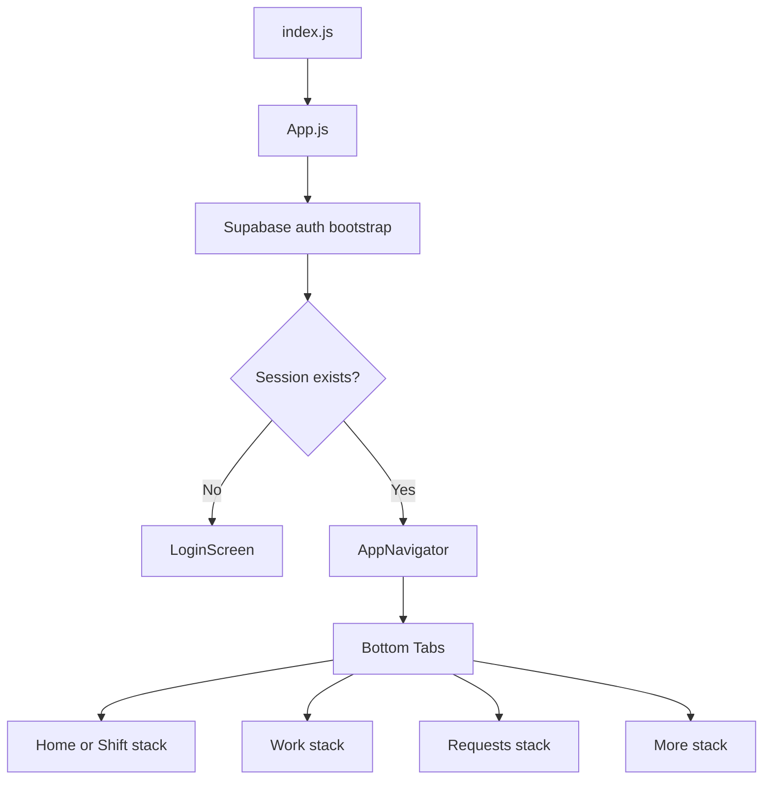
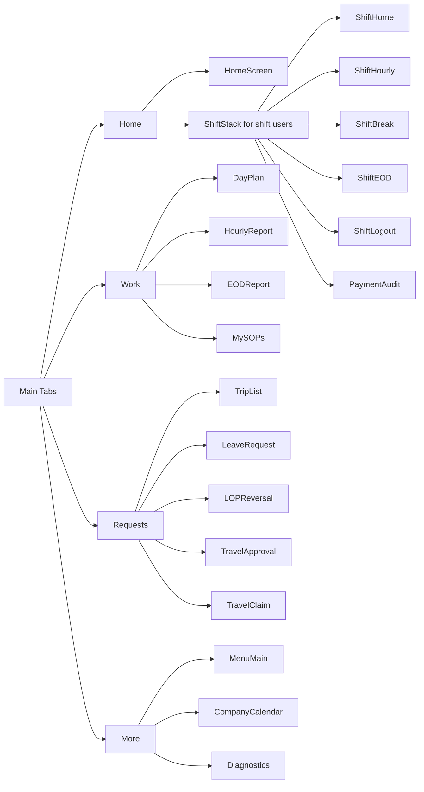
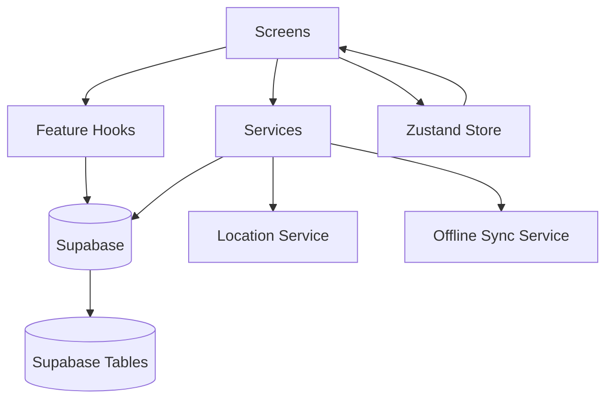

# IGO Mobile App Full Architecture

## 1. Purpose
This document describes the current architecture of the IGO mobile application, including:
- Project structure
- Feature organization
- Navigation map
- Data and API flow
- State and offline strategy
- UI/UX design system composition

## 2. High-Level Overview
The app is built with Expo + React Native and uses Supabase for authentication and backend data operations.

Core app layers:
- Presentation layer: screens + reusable UI components
- Feature logic layer: hooks
- Data access layer: services
- State layer: local store
- App shell: navigation, auth bootstrap, query client

## 3. Project Structure

### 3.1 Root
- App.js
- index.js
- app.json
- package.json
- tsconfig.json
- babel.config.js
- metro.config.js
- eas.json

### 3.2 Source Tree
- src/
- src/assets/
- src/components/
- src/components/ui/
- src/constants/
- src/hooks/
- src/navigation/
- src/screens/
- src/services/
- src/store/
- src/stubs/
- src/theme/
- src/types.ts

### 3.3 UI Components
- src/components/ui/AppScreen.tsx
- src/components/ui/Button.tsx
- src/components/ui/Input.tsx
- src/components/ui/GlassCard.tsx
- src/components/ui/IconButton.tsx
- src/components/ui/StatusBadge.tsx
- src/components/ui/ProgressRing.tsx
- src/components/ui/MapView.tsx
- src/components/ui/MapView.web.tsx

### 3.4 Screens by Feature
- Auth
  - src/screens/auth/LoginScreen.tsx
- Home
  - src/screens/home/HomeScreen.tsx
- Shift
  - src/screens/shift/ShiftHomeScreen.tsx
  - src/screens/shift/ShiftHourlyScreen.tsx
  - src/screens/shift/ShiftBreakScreen.tsx
  - src/screens/shift/ShiftEODScreen.tsx
  - src/screens/shift/ShiftLogoutScreen.tsx
  - src/screens/shift/PaymentAuditScreen.tsx
- Work
  - src/screens/work/DayPlanScreen.tsx
  - src/screens/work/HourlyPlanReportScreen.tsx
  - src/screens/work/EODReportScreen.tsx
  - src/screens/work/MySOPsScreen.tsx
  - src/screens/work/TasksScreen.tsx
  - src/screens/work/ActiveTripScreen.tsx
- Requests
  - src/screens/requests/TripListScreen.tsx
  - src/screens/requests/TravelApprovalScreen.tsx
  - src/screens/requests/TravelClaimScreen.tsx
  - src/screens/requests/LeaveRequestScreen.tsx
  - src/screens/requests/LOPReversalScreen.tsx
- Profile + Utility
  - src/screens/profile/MenuScreen.tsx
  - src/screens/profile/DiagnosticsScreen.tsx
  - src/screens/calendar/CompanyCalendarScreen.tsx

## 4. App Boot and Runtime Flow

## 5. Navigation Architecture

## 6. Data and Service Flow

Primary data operations:
- Auth/session lifecycle in App.js and services/supabase.ts
- Attendance/day start/selfie records in HomeScreen
- Shift workflows through shift hooks
- Travel request lifecycle in request screens
- Offline synchronization through services/offlineSyncService.ts

## 7. State Management
- Global local state: src/store/useLocationStore.ts
- Server data fetching/caching: React Query at app root
- Feature-specific business logic: hooks under src/hooks

## 8. UI/UX System
- Design tokens in src/theme/index.ts
- Reusable shell: AppScreen
- Card system: GlassCard
- Action components: Button, IconButton
- Form controls: Input
- Feedback components: StatusBadge, ProgressRing

Design principles currently implemented:
- Consistent spacing and radius system
- Unified gradients and status palette
- Reusable screen shell for visual consistency
- Improved tab bar hierarchy and touch ergonomics

## 9. Offline and Reliability
- Offline queue and sync handling: src/services/offlineSyncService.ts
- Store tests: src/store/__tests__
- Service tests: src/services/__tests__

## 10. Security and Config
- Supabase URL and anon key are provided by constants and environment fallback.
- Entry-level React Native polyfills are loaded in index.js.

## 11. Suggested Next Evolution
- Apply AppScreen shell to all remaining screens for full visual consistency
- Introduce feature folders with co-located components/hooks per module
- Add typed API layer per table/domain
- Add e2e smoke tests for login and main tab flows

## 12. Quick Index
- App shell: App.js
- Navigation: src/navigation/AppNavigator.tsx
- Theme tokens: src/theme/index.ts
- UI primitives: src/components/ui/
- Screen modules: src/screens/
- Services: src/services/
- Feature hooks: src/hooks/
- State: src/store/useLocationStore.ts
