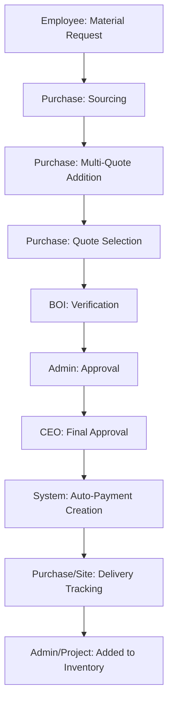

# Purchase Order & Procurement Module Documentation

## Overview
The IGOChain procurement system manages the entire lifecycle of material acquisition, from a site team's initial request to vendor sourcing, multi-level approvals, and final delivery tracking. 

The system currently maintains two parallel procurement tracks:
1. **Integrated Material Procurement**: The primary, end-to-end workflow starting from BOQ-based material requests.
2. **Standalone Purchase Orders**: A legacy/secondary system for direct PO issuance with a dedicated vendor portal.

---

## 1. Integrated Material Procurement Workflow (Primary)

This flow is centered around the `material_requests` table and manages the transition from internal needs to financial fulfillment.

### workflow Steps

#### Actor Roles & Actions
- **Employee/Engineer**: Raises a request for materials required at a specific project phase.
- **Purchase Team**: 
    - Moves request to `sourcing`.
    - Adds multiple vendor quotes (minimum 3 recommended).
    - Selects the best quote for approval.
    - Tracks delivery once ordered.
- **BOI (Bureau of Inspection)**: Audits the quoted request, ensuring prices and requirements match project standards.
- **Admin/CEO**: Final approval authority. CEO usually approves high-value or critical requests.
- **Accounts**: Once approved and converted to a payment request, Accounts executes the payment to the vendor.

#### Key Statuses (`material_requests.status`)
- `pending`: Newly submitted by site team.
- `sourcing`: Purchase department is identifying vendors.
- `quoted`: At least one quote has been added.
- `ordered`: Material has been formally ordered from the vendor.
- `delivered`: Items have arrived at the site and been verified.

#### Order Tracking Statuses (`material_requests.order_status`)
Used for granular tracking after the order is placed:
- `ordered` → `loading` → `shipped` → `unloading` → `delivered`.

---

## 2. Standalone Purchase Order Module (Secondary)

This module uses the `purchase_orders` table and provides a specialized interface for external vendors.

### Features
- **Manual PO Creation**: Independent of the BOQ flow, allowing for quick procurement needs.
- **Vendor Access Control**: Generates a `vendor_access_token` for each PO.
- **Vendor Portal**: A public-facing page (`/vendor-portal/:accessToken`) where vendors can:
    - View PO details (Project, Location, Items).
    - Update dispatch status (`LR Number`, `Transporter`, `Dispatch Date`).
    - Upload invoices directly to the system.
- **Approval Chain**: Submitted -> Admin Approved -> CEO Approved.

---

## 3. Data Models

### `material_requests` (Public Schema)
| Column | Type | Description |
| --- | --- | --- |
| `id` | uuid | Primary key |
| `project_id` | uuid | Link to `projects` |
| `requester_id` | uuid | Link to `profiles` |
| `boq_items` | jsonb | Array of requested items and quantities |
| `status` | text | Workflow status (pending, sourcing, etc.) |
| `order_status` | text | Delivery tracking status |
| `selected_quote_id`| uuid | Link to the winning quote in `vendor_quotes` |
| `approval_status` | text | Approval workflow state |

### `purchase_orders` (Public Schema)
| Column | Type | Description |
| --- | --- | --- |
| `id` | uuid | Primary key |
| `po_number` | integer | Auto-incrementing human-readable ID |
| `vendor_name` | text | Name of the supplier |
| `total_amount` | numeric | Final PO value |
| `vendor_access_token`| text | Secure token for external portal access |
| `delivery_status` | text | Status updated by vendor (DISPATCHED, etc.) |
| `vendor_invoice_url` | text | Link to the uploaded invoice document |

---

## 4. Key Components & Links

### User Interfaces
- **[Purchase Dashboard](file:///c:/Users/hp/Desktop/igochain-main/src/pages/purchase/PurchaseDashboard.tsx)**: The main hub for the purchase department.
- **[Orders Audit Queue (BOI)](file:///c:/Users/hp/Desktop/igochain-main/src/pages/boi/BOIOrdersPage.tsx)**: Central verification point for all material and purchase requests.
- **[Project Procurement Timeline](file:///c:/Users/hp/Desktop/igochain-main/src/pages/admin/ProjectProcurementPage.tsx)**: Visualization of order progress across all projects.
- **[Vendor Portal](file:///c:/Users/hp/Desktop/igochain-main/src/pages/public/VendorPortalPage.tsx)**: The external entry point for vendors.

### Logic & Hooks
- **[useMaterialRequests](file:///c:/Users/hp/Desktop/igochain-main/src/hooks/useMaterialRequests.ts)**: Core logic for the integrated flow.
- **[usePurchaseOrders](file:///c:/Users/hp/Desktop/igochain-main/src/hooks/usePurchaseOrders.ts)**: Management of the standalone PO system.
- **[useVendorQuotes](file:///c:/Users/hp/Desktop/igochain-main/src/hooks/useVendorQuotes.ts)**: Handling multi-vendor price entries.
- **[usePurchaseProgress](file:///c:/Users/hp/Desktop/igochain-main/src/hooks/usePurchaseProgress.ts)**: Logging and tracking updates for active orders.

---

## 5. Technical Design Decisions

- **Quote Comparisons**: The system encourages adding multiple quotes (UI shows `0/3` progress) to ensure cost optimality before approval.
- **Real-time Synchronization**: Procurement updates use Supabase Realtime to notify the site team immediately when an order is shipped or delayed.
- **Document Integrity**: Proof of sourcing (Cost Comparison) and dispatch (Invoice) are mandatory for workflow completion to satisfy audit requirements.
- **Role-Based Visibility**:
    - **Site Team**: Sees only their project's requests and delivery status.
    - **Purchase Team**: Sees all pending sourcing and quoting tasks.
    - **BOI/Admin/CEO**: Sequential approval queue based on their respective roles.
